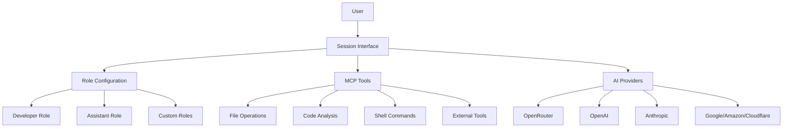

# Octomind 🤖 - AI-Powered Development Assistant

**© 2025 Muvon Un Limited** | [Documentation](doc/README.md)

## 🚀 Session-First AI Development Assistant

Octomind is an AI-powered development assistant that helps you understand, analyze, and interact with your codebase through natural language conversations in interactive sessions.

### 🌟 Key Features

- 🤖 **Session-Based AI Interaction** - Everything happens in interactive sessions
- 🛠️ **Built-in Development Tools** - File operations, code analysis, shell commands via MCP
- 🌐 **Multi-Provider AI Support** - OpenRouter, OpenAI, Anthropic, Google, Amazon, Cloudflare
- 🔧 **Role-Based Configuration** - Developer (with tools) and Assistant (chat only) modes

### 🔧 Quick Start

```bash
# Install Octomind
curl -fsSL https://raw.githubusercontent.com/muvon/octomind/main/install.sh | bash

# Set AI Provider API Key
export OPENROUTER_API_KEY="your_key"

# Start a development session
octomind session
```

### 📖 Documentation

- [**Complete Documentation**](doc/README.md) - Comprehensive guides and references
- [**Installation Guide**](doc/01-installation.md) - Installation methods and setup
- [**Configuration**](doc/02-configuration.md) - Configuration system and settings

### 🌐 Supported AI Providers

| Provider | Format | Features |
|----------|--------|----------|
| OpenRouter | `openrouter:provider/model` | Multi-provider access, caching |
| OpenAI | `openai:model-name` | Direct API, cost calculation |
| Anthropic | `anthropic:model-name` | Claude models, caching |
| Google | `google:model-name` | Vertex AI, multimodal |
| Amazon | `amazon:model-name` | Bedrock models, AWS integration |
| Cloudflare | `cloudflare:model-name` | Edge AI, fast inference |

## 🚀 Installation & Setup

### Installation

```bash
# One-line install (recommended)
curl -fsSL https://raw.githubusercontent.com/muvon/octomind/main/install.sh | bash

# Or build from source
git clone https://github.com/muvon/octomind.git
cd octomind && cargo build --release
```

### Setup

```bash
# Set your AI provider API key
export OPENROUTER_API_KEY="your_key"  # or OPENAI_API_KEY, ANTHROPIC_API_KEY, etc.

# Create configuration
octomind config

# Start your first session
octomind session
```

### Basic Usage

```bash
# Start development session (includes all tools)
octomind session

# Start simple chat session (no tools)
octomind session --role=assistant

# Resume a session
octomind session --resume my_session

# Use specific model
octomind session --model "openrouter:anthropic/claude-3.5-sonnet"
```

## How It Works

Instead of complex command-line tools, simply talk to Octomind:

```
> "How does authentication work in this project?"
[AI analyzes project structure, finds auth-related files, explains implementation]

> "Add error handling to the login function"
[AI examines login code, implements error handling, shows changes]

> "Why is the build failing?"
[AI checks build errors, analyzes code, suggests fixes]
```

### Core Principles

#### 🎯 Session-First Architecture
Everything happens within interactive AI sessions. No separate indexing or search commands - just natural conversation with AI assistants that have built-in development tools.

#### 🔧 Role-Based Configuration
- **Developer Role**: Full development environment with all tools enabled
- **Assistant Role**: Simple conversation mode without development tools

#### 🛠️ Built-in Development Tools
File operations, code analysis, and shell command execution via MCP (Model-Centric Programming) protocol - all accessible through natural conversation.

#### 🌐 Multiple AI Provider Support
OpenRouter, OpenAI, Anthropic, Google Vertex AI, Amazon Bedrock, Cloudflare Workers AI with unified `provider:model` format.

### Session Commands

Within any session, use these commands:
- `/help` - Show available commands
- `/model [model]` - Show/change current model
- `/info` - Display token usage and costs
- `/cache` - Mark cache checkpoint for cost savings
- `/done` - Optimize context and restart layered processing
- `/layers` - Toggle layered processing on/off
- `/debug` - Toggle debug logging
- `/exit` - Exit session

## Key Features

- **Interactive AI Sessions**: Work with your codebase through natural conversation
- **Project Context Awareness**: Automatic project analysis and context collection
- **Layered Architecture**: Multi-stage AI processing for complex development tasks
- **Token Management**: Cost tracking, caching, and automatic context optimization
- **Session Management**: Save, resume, and organize development conversations
- **Extensible Tool System**: MCP protocol support for integrating external tools

## Documentation

📖 **[Complete Documentation](./doc/README.md)** - Comprehensive guides and references

### Quick Links
- **[Installation Guide](./doc/01-installation.md)** - Detailed installation methods
- **[Configuration Guide](./doc/02-configuration.md)** - Configuration system and settings

## Configuration Example

```toml
# .octomind/config.toml
version = 1
log_level = "none"
model = "openrouter:anthropic/claude-3.5-sonnet"
mcp_response_warning_threshold = 20000
max_request_tokens_threshold = 50000
enable_auto_truncation = false
cache_tokens_threshold = 2048
cache_timeout_seconds = 240
enable_markdown_rendering = false
markdown_theme = "default"
max_session_spending_threshold = 0.0

# Developer role configuration
[developer]
enable_layers = true
layer_refs = []

[developer.config]
enable_layers = true
system = "You are an Octomind AI developer assistant with full access to development tools."

[developer.mcp]
server_refs = ["developer", "filesystem"]
allowed_tools = []

# Assistant role configuration
[assistant]
enable_layers = false
layer_refs = []

[assistant.config]
enable_layers = false
system = "You are a helpful assistant."

[assistant.mcp]
server_refs = ["filesystem"]
allowed_tools = ["text_editor", "list_files"]

# MCP server registry
[mcp.servers]
# Servers are configured here
```

### Key Configuration Points

- API keys set via environment variables for security
- Single system-wide model setting
- Role-based configurations (developer/assistant)
- MCP server registry for tool integration

## Supported AI Providers

| Provider | Format | Features |
|----------|--------|----------|
| OpenRouter | `openrouter:provider/model` | Multi-provider access, caching |
| OpenAI | `openai:model-name` | Direct API, cost calculation |
| Anthropic | `anthropic:model-name` | Claude models, caching |
| Google | `google:model-name` | Vertex AI, multimodal |
| Amazon | `amazon:model-name` | Bedrock models, AWS integration |
| Cloudflare | `cloudflare:model-name` | Edge AI, fast inference |

## Architecture



## Contributing

Contributions are welcome! Please feel free to submit a Pull Request.

- **Adding New AI Providers**: See `src/session/providers/` for examples
- **Adding New MCP Tools**: Configure via MCP server registry or add to existing servers
- **Documentation Updates**: Update both code and documentation

```bash
# Development setup
cargo test
cargo build
make install
```

## Troubleshooting

### Common Issues
- **Configuration Errors**: Check your `.octomind/config.toml` file
- **Missing API Keys**: Set environment variables for your AI provider
- **Invalid Model Format**: Use `provider:model` format (e.g., `openrouter:anthropic/claude-3.5-sonnet`)
- **Session Issues**: Use `/debug` to toggle debug logging

### Getting Help
- **Issues**: [GitHub Issues](https://github.com/muvon/octomind/issues)
- **Documentation**: [Complete Documentation](./doc/README.md)
- **Email**: [opensource@muvon.io](mailto:opensource@muvon.io)

## 📞 Support & Contact

- **Issues**: [GitHub Issues](https://github.com/muvon/octomind/issues)
- **Email**: [opensource@muvon.io](mailto:opensource@muvon.io)
- **Company**: Muvon Un Limited (Hong Kong)
- **Website**: [muvon.io](https://muvon.io)
- **Product Page**: [octomind.muvon.io](https://octomind.muvon.io)

## Contributing

Contributions are welcome! Please feel free to submit a Pull Request.

- **Adding New AI Providers**: See `src/session/providers/` for examples
- **Adding New MCP Tools**: Configure via MCP server registry or add to existing servers
- **Documentation Updates**: Update both code and documentation

```bash
# Development setup
git clone https://github.com/muvon/octomind
cd octomind
cargo build --release
cargo test
```

## Requirements
- Rust 1.70+
- Cargo
- API key from supported providers

## ⚖️ License

**Apache License 2.0**
Copyright © 2025 Muvon Un Limited
