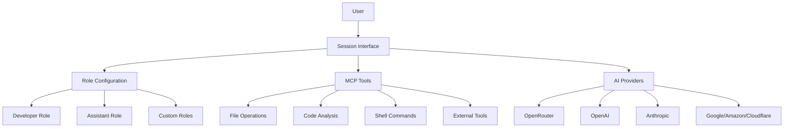

# Octomind 🤖 - AI-Powered Development Assistant

**© 2025 Muvon Un Limited** | [Documentation](doc/README.md)

## 🚀 Intelligent Code Companion

Octomind is an AI-powered development assistant that helps you understand, analyze, and interact with your codebase through natural language conversations.

### 🌟 Key Features

- 🤖 **AI-Powered Code Interaction**
- 🛠️ **Multi-Tool Development Environment**
- 🌐 **Multi-Provider AI Support**
- 🔒 **Secure, Environment-Driven Configuration**

### 🔧 Quick Start

```bash
# Install Octomind
cargo install octomind

# Set AI Provider API Key
export OPENROUTER_API_KEY="your_key"

# Start a development session
octomind session
```

### 📖 Comprehensive Documentation

- [**Installation Guide**](doc/01-installation.md)
- [**Configuration**](doc/02-configuration.md)
- [**AI Providers**](doc/03-providers.md)
- [**Sessions**](doc/05-sessions.md)
- [**Advanced Features**](doc/06-advanced.md)

### 🌐 Supported AI Providers

| Provider | Capabilities |
|----------|--------------|
| OpenRouter | Multi-provider access |
| OpenAI | Direct API |
| Anthropic | Claude models |
| Google | Vertex AI |
| Amazon | Bedrock models |
| Cloudflare | Edge AI |

### 🤝 Contributing

- Report issues
- Submit pull requests
- Improve documentation

**Apache License 2.0**

## 🚀 Quick Start

### 1. Installation

```bash
# 🔧 One-Line Install
curl -fsSL https://raw.githubusercontent.com/muvon/octomind/main/install.sh | bash

# 💻 Or Build from Source
git clone https://github.com/muvon/octomind.git
cd octomind && cargo build --release
```

### 2. Setup & Configuration

```bash
# 🔐 Set Your AI Provider Key
export OPENROUTER_API_KEY="your_key"
# Or: OPENAI_API_KEY, ANTHROPIC_API_KEY

# 🛠️ Initialize Configuration
octomind config

# 🚀 Launch Your First Session
octomind session
```

### 3. Powerful Usage Modes

```bash
# 💻 Full Development Session
octomind session

# 💬 Simple Chat Mode
octomind session --role=assistant

# 🔄 Resume Previous Session
octomind session --resume my_project

# 🤖 Use Specific AI Model
octomind session --model "openrouter:anthropic/claude-sonnet-4"
```

### 🌟 Why Developers Choose Octomind

- 🔒 **Secure by Design**: Environment-first configuration
- 🌐 **Multi-Provider Support**: OpenRouter, OpenAI, Anthropic, and more
- 🧠 **Intelligent Context Understanding**
- 🛠️ **Fully Customizable Development Workflow**
- 🤖 **Extensible Layered AI Processing**

### 🔧 Configuration & Flexibility

Octomind offers a powerful, flexible configuration system with:
- Environment-driven API management
- Role-based AI interactions
- Customizable session behaviors

**Quick Configuration Example:**
```toml
# Full details in doc/02-configuration.md
model = "openrouter:anthropic/claude-3.5-sonnet"
log_level = "none"

[developer]
enable_layers = true
```

### 🛠️ Integrated Development Tools

- File operations
- Code analysis
- Shell command execution
- Project context understanding

### 🌐 Multi-Provider Support

Seamlessly switch between AI providers:
- OpenRouter
- OpenAI
- Anthropic
- Google
- Amazon
- Cloudflare

**Learn More:** [Provider Setup Guide](doc/03-providers.md)

## 🧠 Intelligent Development Companion

Octomind transforms how you interact with your codebase:

```
> "Explain the authentication flow in this project"
[AI performs deep code analysis, traces auth implementation, provides comprehensive overview]

> "Refactor login function with robust error handling"
[AI intelligently modifies code, adds logging, implements best practices]

> "Debug the build failure"
[AI diagnoses root cause, suggests precise fixes, prevents future issues]
```

### 🛠️ Powerful Session Commands

Enhance your workflow with intuitive commands:
- `/help` - Discover available tools
- `/model` - Switch AI models on-the-fly
- `/info` - Track token usage and costs
- `/cache` - Optimize context management
- `/done` - Restart layered processing
- `/exit` - Conclude session

### 🚀 Create Your Own AI Development Ecosystem

#### Custom Roles Example

```toml
# Define a specialized security review role
[security-auditor]
system = """
You are a cybersecurity expert focused on identifying 
potential vulnerabilities in code implementations.
Analyze each change with a critical security lens.
"""
enable_layers = true

# Limit tools for focused analysis
[security-auditor.mcp]
server_refs = ["developer", "filesystem"]
allowed_tools = ["text_editor", "shell"]

# Custom command for security scanning
[[security-auditor.commands]]
name = "vulnerability-scan"
model = "openrouter:anthropic/claude-3.5-sonnet"
system_prompt = "Perform a comprehensive security vulnerability assessment."
```

### 💡 Why Developers Love Octomind

- **Hyper-Configurable**: Build your perfect AI development assistant
- **Context-Aware**: Understands your entire project ecosystem
- **Proactive**: Suggests improvements, not just fixes
- **Adaptive**: Learns from your codebase and coding style
- **Secure**: Enterprise-grade security and privacy

### 🌈 Infinite Possibilities

Octomind isn't just a tool—it's a canvas for your AI development imagination. 
Create roles, design layers, integrate tools, and transform how you code.

## Key Features

- **Interactive AI Sessions**: Work with your codebase through natural conversation
- **Project Context Awareness**: Automatic project analysis and context collection
- **Layered Architecture**: Multi-stage AI processing for complex development tasks
- **Token Management**: Cost tracking, caching, and automatic context optimization
- **Session Management**: Save, resume, and organize development conversations
- **Extensible Tool System**: MCP protocol support for integrating external tools

## Documentation

📖 **[Complete Documentation](./doc/README.md)** - Comprehensive guides and references

### Quick Links
- **[Installation Guide](./doc/01-installation.md)** - Detailed installation methods, cross-compilation, shell completions
- **[Configuration Guide](./doc/02-configuration.md)** - Configuration system and settings
- **[Provider Setup](./doc/03-providers.md)** - AI provider setup and management
- **[Session Guide](./doc/05-sessions.md)** - Interactive sessions and modes
- **[Advanced Features](./doc/06-advanced.md)** - MCP tools, layered architecture, and extensibility

## Configuration Example

```toml
# .octomind/config.toml
# 🌐 System-wide configuration
model = "openrouter:anthropic/claude-3.5-sonnet"
log_level = "none"
enable_markdown_rendering = false

# 🤖 Developer Role
[developer]
enable_layers = true
system = "You are an Octomind AI developer assistant with full access to development tools."

[developer.mcp]
server_refs = ["developer", "filesystem"]

# 💬 Assistant Role
[assistant]
enable_layers = false
system = "You are a helpful assistant."

[assistant.mcp]
server_refs = ["filesystem"]
allowed_tools = ["text_editor", "list_files"]

# 🔧 Optional: Custom Layers
[[layers]]
name = "query_processor"
model = "openrouter:openai/gpt-4.1-mini"
temperature = 0.2
input_mode = "last"
```

### Key Configuration Points

- 🔐 API keys set via environment variables
- 🌐 Single system-wide model
- 🛠️ Explicit role configurations
- 🤖 Optional custom layers

## Supported AI Providers

| Provider | Format | Features |
|----------|--------|----------|
| OpenRouter | `openrouter:provider/model` | Multi-provider access, caching |
| OpenAI | `openai:model-name` | Direct API, cost calculation |
| Anthropic | `anthropic:model-name` | Claude models, caching |
| Google | `google:model-name` | Vertex AI, multimodal |
| Amazon | `amazon:model-name` | Bedrock models, AWS integration |
| Cloudflare | `cloudflare:model-name` | Edge AI, fast inference |

## Architecture



## Contributing

Contributions are welcome! Please feel free to submit a Pull Request.

- **Adding New AI Providers**: See `src/session/providers/` for examples
- **Adding New MCP Tools**: Configure via MCP server registry or add to existing servers
- **Documentation Updates**: Update both code and documentation

```bash
# Development setup
cargo test
cargo build
make install
```

## Troubleshooting

### Common Issues
- **Configuration Errors**: Run `octomind config --validate`
- **Missing API Keys**: Set environment variables for your AI provider
- **Invalid Model Format**: Use `provider:model` format (e.g., `openrouter:anthropic/claude-sonnet-4`)
- **Session Issues**: Use `/debug` to enable detailed logging

### Getting Help
- **Issues**: [GitHub Issues](https://github.com/muvon/octomind/issues)
- **Documentation**: [Complete Documentation](./doc/README.md)
- **Email**: [opensource@muvon.io](mailto:opensource@muvon.io)

## 📞 Support & Contact

- **Issues**: [GitHub Issues](https://github.com/muvon/octomind/issues)
- **Email**: [opensource@muvon.io](mailto:opensource@muvon.io)
- **Company**: Muvon Un Limited (Hong Kong)
- **Website**: [muvon.io](https://muvon.io)
- **Product Page**: [octomind.muvon.io](https://octomind.muvon.io)

## 🤝 Contributing & Development

### Quick Setup
```bash
# Clone and build
git clone https://github.com/muvon/octomind
cd octomind
cargo build --release
cargo test
```

### How to Contribute
- [Report Issues](https://github.com/muvon/octomind/issues)
- [Submit Pull Requests](https://github.com/muvon/octomind/pulls)
- Improve Documentation

### Extending Octomind
- [Adding Providers](doc/03-providers.md)
- [MCP Tool Integration](doc/06-advanced.md)

## 📋 Requirements
- Rust 1.70+
- Cargo
- API key from supported providers

## ⚖️ License

**Apache License 2.0**
Copyright © 2025 Muvon Un Limited
