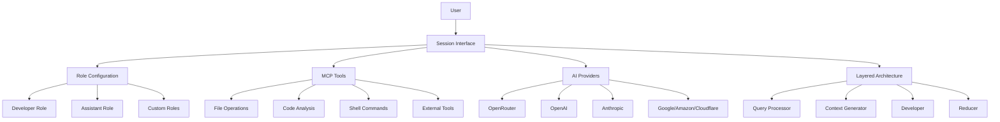

# Octodev - AI-Powered Development Assistant

Octodev is a session-based AI development assistant that helps you understand and work with your codebase through interactive conversations. Built with a simplified, session-first approach, it provides intelligent code assistance with built-in tools for file operations, code analysis, and development tasks.

## Features

- **Interactive AI Sessions**: Work with your codebase through natural conversation
- **Role-Based Configuration**: Developer, Assistant, and Custom roles with different tool access
- **Built-in Development Tools**: File operations, code analysis, and shell command execution via MCP
- **Multiple AI Provider Support**: OpenRouter, OpenAI, Anthropic, Google Vertex AI, Amazon Bedrock, Cloudflare Workers AI
- **Layered Architecture**: Multi-stage AI processing for complex development tasks
- **Project Context Awareness**: Automatic project analysis and context collection
- **Token Management**: Cost tracking, caching, and automatic context optimization
- **Extensible Tool System**: MCP protocol support for integrating external tools and services
- **Session Management**: Save, resume, and organize development conversations
- **Enhanced Tool Output Rendering**: Improved display and handling of tool outputs
- **Command Layers**: Specialized AI helpers for specific tasks without affecting session history
- **Robust Tool Execution**: Smart tool routing with proper server mapping and error handling

## Installation

### Quick Install (Recommended)

Use our installation script to automatically download the appropriate binary for your platform:

```bash
# Install latest version
curl -fsSL https://raw.githubusercontent.com/muvon/octodev/main/install.sh | bash

# Or download and inspect first
curl -fsSL https://raw.githubusercontent.com/muvon/octodev/main/install.sh -o install.sh
chmod +x install.sh
./install.sh
```

### Manual Installation

Download pre-compiled binaries from the [releases page](https://github.com/muvon/octodev/releases) for your platform:

- **Linux**: `octodev-{version}-x86_64-unknown-linux-{gnu,musl}.tar.gz`
- **macOS**: `octodev-{version}-{x86_64,aarch64}-apple-darwin.tar.gz`
- **Windows**: `octodev-{version}-x86_64-pc-windows-gnu.zip`

Extract and place the binary in your `PATH`.

### Package Managers

**Homebrew** (macOS/Linux):
```bash
# Coming soon
brew install muvon/tap/octodev
```

**Cargo** (Build from source):
```bash
cargo install --git https://github.com/muvon/octodev.git
```

### Prerequisites for Building

- Rust 1.70+ and Cargo installed on your system
- No additional runtime dependencies - embedded SurrealDB is used for storage

### Building from Source

```bash
# Clone the repository
git clone https://github.com/muvon/octodev.git
cd octodev

# Quick build for development
make build

# Or build manually
cargo build --release

# Install to system
make install
```

### Cross-Compilation

Octodev includes a comprehensive cross-compilation setup for building static binaries across multiple platforms.

#### Supported Platforms

- **Linux**: x86_64 and aarch64 (glibc and musl)
- **macOS**: x86_64 and Apple Silicon (aarch64)
- **Windows**: x86_64

#### Build System Setup

```bash
# Install cross-compilation tools
make setup

# Check your environment
make check

# Build for all platforms
make build-all

# Build for specific platforms
make build-linux      # All Linux targets
make build-windows    # Windows targets
make build-macos      # macOS targets (macOS host only)

# Build for specific target
make x86_64-unknown-linux-musl

# Create distribution archives
make dist
```

#### Individual Platform Builds

```bash
# Linux targets (using cross)
make x86_64-unknown-linux-gnu
make x86_64-unknown-linux-musl
make aarch64-unknown-linux-gnu
make aarch64-unknown-linux-musl

# Windows target (using cross)
make x86_64-pc-windows-gnu

# macOS targets (native only, requires macOS)
make x86_64-apple-darwin
make aarch64-apple-darwin
```

#### Requirements for Cross-Compilation

**All Platforms:**
- Rust toolchain with cross-compilation targets
- [cross](https://github.com/cross-rs/cross) tool for Linux/Windows builds
- Docker or Podman for containerized builds

**Installation:**
```bash
# Install targets
rustup target add x86_64-unknown-linux-gnu
rustup target add x86_64-unknown-linux-musl
rustup target add aarch64-unknown-linux-gnu
rustup target add aarch64-unknown-linux-musl
rustup target add x86_64-pc-windows-gnu
rustup target add x86_64-apple-darwin      # macOS only
rustup target add aarch64-apple-darwin     # macOS only

# Install cross tool
cargo install cross --git https://github.com/cross-rs/cross
```

#### Static Linking Configuration

All builds use static linking by default for maximum compatibility:

- **Linux**: Uses musl targets for fully static binaries
- **Windows**: Uses static CRT linking
- **macOS**: Uses static linking where possible

The build configuration in `Cargo.toml` enables:
- Link Time Optimization (LTO)
- Single codegen unit for better optimization
- Panic abort for smaller binaries
- Symbol stripping

#### GitHub Actions CI/CD

Automated builds are configured for:
- All platforms on every push/PR
- Release artifacts on git tags
- Docker images for containerized deployment
- Automated security audits and code quality checks

See `.github/workflows/cross-build.yml` for the complete CI configuration.

#### Docker Support

Build and run in containers:

```bash
# Build Docker image
docker build -t octodev .

# Run in container
docker run --rm -v $(pwd):/workspace octodev index /workspace
```

#### Build Configuration Files

- **`Makefile`**: Comprehensive build system with all targets
- **`Cross.toml`**: Configuration for cross-compilation tool
- **`Dockerfile`**: Multi-stage build for minimal container image
- **`.github/workflows/cross-build.yml`**: CI/CD pipeline

## AI Providers

Octodev supports multiple AI providers through an extensible architecture. You can use different providers and models by specifying them in the `provider:model` format.

### Supported Providers

#### OpenRouter (Default)
- **Models**: All OpenRouter models (Anthropic, OpenAI, Google, etc.)
- **API Key**: Set `OPENROUTER_API_KEY` environment variable or configure in `.octodev/config.toml`
- **Features**: Full tool support, caching (for Claude models), cost tracking

#### OpenAI
- **Models**: GPT-4, GPT-3.5, O1, and other OpenAI models
- **API Key**: Set `OPENAI_API_KEY` environment variable
- **Features**: Full tool support, built-in cost calculation

#### Anthropic
- **Models**: Claude 3.5, Claude 3, Claude 2, and Claude Instant models
- **API Key**: Set `ANTHROPIC_API_KEY` environment variable
- **Features**: Full tool support, built-in cost calculation, caching support

#### Google Vertex AI
- **Models**: Gemini 1.5, Gemini 1.0, and Bison models
- **Authentication**: Service account authentication (see setup below)
- **Features**: Full tool support, built-in cost calculation

#### Amazon Bedrock
- **Models**: Claude, Llama, Command, and other Bedrock models
- **Authentication**: AWS credentials (access key/secret key)
- **Features**: Full tool support, built-in cost calculation, AWS integration

#### Cloudflare Workers AI
- **Models**: Llama, Mistral, and other Workers AI models
- **Authentication**: Cloudflare API token and account ID
- **Features**: Edge AI inference, fast response times, cost-effective

### Model Format

All models must now be specified with the `provider:model` format:

```bash
# OpenRouter models
octodev session --model "openrouter:anthropic/claude-3.5-sonnet"
octodev session --model "openrouter:openai/gpt-4o"

# OpenAI models (direct)
octodev session --model "openai:gpt-4o"
octodev session --model "openai:o1-preview"

# Anthropic models (direct)
octodev session --model "anthropic:claude-3-5-sonnet"
octodev session --model "anthropic:claude-3-opus"

# Google Vertex AI models
octodev session --model "google:gemini-1.5-pro"
octodev session --model "google:gemini-1.5-flash"

# Amazon Bedrock models
octodev session --model "amazon:claude-3-5-sonnet"
octodev session --model "amazon:llama-3.1-70b-instruct"

# Cloudflare Workers AI models
octodev session --model "cloudflare:llama-3.1-8b-instruct"
octodev session --model "cloudflare:mistral-7b-instruct"
```

### Configuration

Configure providers in your `.octodev/config.toml`:

```toml
# Centralized provider configuration (recommended)
[providers.openrouter]
api_key = "your_openrouter_key"  # Optional, can use env var

[providers.openai]
api_key = "your_openai_key"

[providers.anthropic]
api_key = "your_anthropic_key"

[providers.amazon]
region = "us-east-1"
access_key_id = "your_access_key"
secret_access_key = "your_secret_key"

[providers.cloudflare]
account_id = "your_account_id"
api_token = "your_api_token"

# Role-specific model configuration
[developer]
model = "openrouter:anthropic/claude-sonnet-4"

[assistant]
model = "openai:gpt-4o-mini"  # Use OpenAI for assistant mode

# Legacy configuration (still supported)
[openrouter]
model = "openrouter:anthropic/claude-sonnet-4"
api_key = "your_openrouter_key"  # Optional, can use env var
```

### Environment Variables

Set the appropriate API keys:

```bash
# For OpenRouter
export OPENROUTER_API_KEY="your_openrouter_key"

# For OpenAI
export OPENAI_API_KEY="your_openai_key"

# For Anthropic
export ANTHROPIC_API_KEY="your_anthropic_key"

# For Google Vertex AI (requires service account setup)
export GOOGLE_APPLICATION_CREDENTIALS="/path/to/service-account.json"
export GOOGLE_PROJECT_ID="your-gcp-project-id"
export GOOGLE_REGION="us-central1"  # Optional, defaults to us-central1

# For Amazon Bedrock
export AWS_ACCESS_KEY_ID="your_access_key"
export AWS_SECRET_ACCESS_KEY="your_secret_key"
export AWS_REGION="us-east-1"  # Optional, defaults to us-east-1

# For Cloudflare Workers AI
export CLOUDFLARE_API_TOKEN="your_api_token"
export CLOUDFLARE_ACCOUNT_ID="your_account_id"
```

#### Google Vertex AI Setup

Google Vertex AI requires service account authentication:

1. **Create a Service Account** in Google Cloud Console
2. **Download the JSON key file**
3. **Set environment variables**:
  ```bash
  export GOOGLE_APPLICATION_CREDENTIALS="/path/to/your/service-account.json"
  export GOOGLE_PROJECT_ID="your-project-id"
  ```
4. **Enable the Vertex AI API** in your Google Cloud project

Note: The Google provider currently requires additional OAuth2 implementation for full functionality.

#### Amazon Bedrock Setup

Amazon Bedrock requires AWS credentials:

1. **Create AWS IAM user** with Bedrock access permissions
2. **Generate access keys** for the IAM user
3. **Set environment variables**:
  ```bash
  export AWS_ACCESS_KEY_ID="your_access_key"
  export AWS_SECRET_ACCESS_KEY="your_secret_key"
  export AWS_REGION="us-east-1"
  ```
4. **Enable model access** in the Bedrock console for the models you want to use

#### Cloudflare Workers AI Setup

Cloudflare Workers AI requires API credentials:

1. **Get your Account ID** from the Cloudflare dashboard
2. **Create an API token** with Workers AI permissions
3. **Set environment variables**:
  ```bash
  export CLOUDFLARE_ACCOUNT_ID="your_account_id"
  export CLOUDFLARE_API_TOKEN="your_api_token"
  ```

## Usage

Octodev has been simplified to focus on interactive sessions. All codebase analysis, searching, and development tasks are now performed within AI-powered sessions.

### System Variables and Placeholders

Octodev supports dynamic system variables that can be used in prompts and system messages. These variables provide real-time information about your development environment.

#### Available Variables

**Individual Variables:**
- **`%{DATE}`** - Current date and time with timezone
- **`%{SHELL}`** - Current shell name and version
- **`%{OS}`** - Operating system information with architecture and platform details
- **`%{BINARIES}`** - List of available development tools and their versions (one per line)
- **`%{CWD}`** - Current working directory
- **`%{GIT_STATUS}`** - Git repository status
- **`%{GIT_TREE}`** - Git file tree
- **`%{README}`** - Project README content

**Comprehensive Variables:**
- **`%{SYSTEM}`** - Complete system information (date, shell, OS, binaries, CWD)
- **`%{CONTEXT}`** - Project context information (README, git status, git tree)

*Note: The comprehensive variables (`%{SYSTEM}` and `%{CONTEXT}`) provide organized collections of the individual variables above.*

#### Viewing Variables

Use the `vars` command to inspect all available variables:

```bash
# List all variables with descriptions
cargo run -- vars

# Show actual values (expanded view)  
cargo run -- vars --expand
cargo run -- vars -e
```

#### Development Tool Detection

The `%{BINARIES}` variable automatically detects and reports versions of common development tools:

- **Build tools**: `rustc`, `gcc`, `clang`, `make`
- **Languages**: `node`, `npm`, `python`, `python3`, `go`, `java`, `php`
- **Utilities**: `awk`, `sed`, `rg`, `git`, `docker`, `curl`, `wget`, `tar`, `zip`, `unzip`

Tools are detected asynchronously for optimal performance, showing either their version or "missing" if not available. Each tool is listed on a separate line for better readability.

#### Performance Optimization

The placeholder system is optimized for performance:
- **Smart Detection**: Only gathers data for placeholders that actually exist in the system prompt
- **Async Execution**: System information gathering runs asynchronously for maximum performance
- **Lazy Loading**: Expensive operations like project context collection only run when needed
- **Token Counting**: Uses tiktoken-rs for accurate token counting instead of character counting

#### System Information

The variables provide comprehensive system information:
- **OS details**: Platform, architecture, distribution (Linux), version (macOS/Windows), kernel version
- **Shell info**: Shell name with version detection
- **Development environment**: Complete toolchain visibility

### Markdown Themes

Octodev includes a beautiful markdown rendering system with multiple themes to enhance your experience. You can choose from various color schemes that work well in different terminal environments.

#### Available Themes

| Theme | Description | Best For |
|-------|-------------|----------|
| `default` | Improved default theme with gold headers and enhanced contrast | Most terminal setups |
| `dark` | Optimized for dark terminals with bright, vibrant colors | Dark terminal backgrounds |
| `light` | Perfect for light terminal backgrounds with darker colors | Light terminal backgrounds |
| `ocean` | Beautiful blue-green palette inspired by ocean themes | Users who prefer calm, aquatic colors |
| `solarized` | Based on the popular Solarized color scheme | Fans of the classic Solarized palette |
| `monokai` | Inspired by the popular Monokai syntax highlighting theme | Users familiar with Monokai from code editors |

#### Configuring Themes

```bash
# Set a theme
octodev config --markdown-theme ocean

# Enable markdown rendering (if not already enabled)
octodev config --markdown-enable true

# View current theme
octodev config --show

# See all available themes (error message shows valid options)
octodev config --markdown-theme invalid
```

#### Theme Examples

All themes include:
- **Headers**: Different colors for H1-H6 headings with proper hierarchy
- **Code blocks**: Syntax highlighting with appropriate background colors
- **Inline code**: Distinct styling for `inline code`
- **Lists**: Colored bullets and proper indentation
- **Emphasis**: Bold, italic, and strikethrough text styling
- **Quotes**: Blockquote styling with appropriate markers
- **Links**: Underlined and colored link text

The themes automatically work in:
- Interactive sessions (`octodev session`)
- Ask command (`octodev ask "Show me markdown"`)
- Multimode (`octodev ask` without arguments)

### Basic Usage

#### 1. Start a Development Session

```bash
# Start a new development session (includes full development tools)
octodev session

# Start with a specific name
octodev session --name my_project

# Resume an existing session
octodev session --resume my_project
```

#### 2. Configure Your Setup

```bash
# Create default configuration
octodev config

# Set embedding provider
octodev config --provider fastembed
```

### Session Modes

Octodev supports different session roles for various use cases:

```bash
# Developer role (default) - Full development environment
octodev session
octodev session --role=developer

# Assistant role - Simple conversation without development tools
octodev session --role=assistant

# Custom role - Use any role defined in your configuration
octodev session --role=my-custom-role

# With specific model and name
octodev session --model "openai:gpt-4o" --name chat_session

# Resume an existing session
octodev session --resume my_session
```

### Available Session Commands

Within any session, you can use these commands:

- `/help` - Show help for all available commands
- `/exit` or `/quit` - Exit the session
- `/list` - List all available sessions
- `/session [name]` - Switch to another session or create a new one
- `/model [model]` - Show current model or change to a different model
- `/clear` - Clear the screen
- `/save` - Save the current session
- `/cache` - Mark a cache checkpoint for token saving
- `/done` - Optimize the session context and restart layered processing
- `/layers` - Toggle layered processing architecture on/off
- `/truncate [threshold]` - Toggle automatic context truncation
- `/info` - Display detailed token and cost breakdowns by layer
- `/debug` - Toggle debug mode for detailed logs

### Working with Your Codebase

Octodev automatically handles project analysis through natural conversation:

1. **Ask about your code**: "How does authentication work in this project?"
2. **Request modifications**: "Add error handling to the login function"
3. **Debug issues**: "Why is the build failing?"
4. **Explore structure**: "Show me the main configuration files"

All codebase operations happen automatically through the session's built-in tools.

#### Session Roles

Octodev supports flexible session roles for different use cases, with two defaults provided:

**Developer Role (Default)** - Full development environment:
- Complete codebase indexing and analysis
- All development tools enabled (file operations, shell commands, code search)
- Project context collection (README, git info, file structure)
- Layered architecture support enabled by default for complex tasks
- Complex developer-focused system prompts
- File watching for code changes

**Assistant Role** - Simple conversation:
- No codebase indexing (faster startup)
- Tools disabled by default (configurable)
- Simple assistant system prompts
- Direct model interaction (layers disabled by default)
- Lighter resource usage

**Custom Roles** - Extensible system:
- Any custom role can be defined in the configuration
- All custom roles inherit from the assistant role as a base
- Custom configurations override the inherited settings
- Use `--role=your-custom-role` to use any configured role

#### Role Configuration

Each role can be configured independently with its own model, tool settings, and behavior. Roles follow an inheritance pattern where custom roles inherit from the assistant role first, then apply their own overrides:

```toml
# Global MCP configuration (fallback for all roles)
[mcp]
enabled = true

[[mcp.servers]]
enabled = true
name = "developer"
server_type = "developer"

[[mcp.servers]]
enabled = true
name = "filesystem"
server_type = "filesystem"

# Developer role configuration (inherits from global MCP by default)
[developer]
model = "openrouter:anthropic/claude-sonnet-4"
enable_layers = true
system = "You are an Octodev AI developer assistant with full access to development tools."

# Assistant role configuration (tools disabled by default)
[assistant]
model = "openrouter:anthropic/claude-3.5-haiku"  # Faster/cheaper model
enable_layers = false
system = "You are a helpful assistant."

[assistant.mcp]
enabled = false  # Override global MCP to disable tools

# Custom role configuration (inherits from assistant, then applies overrides)
[my-custom-role]
model = "openrouter:openai/gpt-4o"
enable_layers = true
system = "You are a specialized assistant for my specific use case."

[my-custom-role.mcp]
enabled = true  # Enable tools for this custom role

[[my-custom-role.mcp.servers]]
enabled = true
name = "developer"
server_type = "developer"
tools = ["shell", "text_editor"]  # Limit to specific tools
```

#### Layered Architecture

Octodev's first message in each session uses a specialized 3-layer AI architecture for enhanced code understanding and modification:

1. **Query Processor**: Analyzes and improves your initial query for clearer instructions (no tools)
2. **Context Generator**: Gathers all necessary code context using tools to explore the codebase
3. **Developer**: Executes the actual coding tasks and produces comprehensive responses using tools

The **Reducer** layer functionality is still available but now invoked manually through the `/done` command instead of automatically running after every interaction. This gives you control over when to optimize context.

After the first message, subsequent interactions go directly to the Developer model for more efficient conversation flow. You can explicitly request context optimization and restart the full layered pipeline at any time using the `/done` command.

This architecture brings several benefits:
- Improved task specialization with each layer focused on what it does best
- Optimized token usage through systematic context management
- Clearer responsibility boundaries between layers
- Better documentation maintenance with on-demand context reduction
- Cost efficiency by using simpler models for less complex tasks
- Enhanced tools utilization with tools available only to layers that need them

Enable layered processing with the `/layers` command in any session.

#### Session Commands

While in an interactive session, you can use the following commands:

- `/help` - Show help for all available commands
- `/exit` or `/quit` - Exit the session
- `/list` - List all available sessions
- `/session [name]` - Switch to another session or create a new one (empty creates fresh session)
- `/model [model]` - Show current model or change to a different model
- `/clear` - Clear the screen
- `/save` - Save the current session
- `/cache` - Mark a cache checkpoint for token saving
- `/done` - Optimize the session context and restart the layered processing for the next message
- `/layers` - Toggle layered processing architecture on/off
- `/truncate [threshold]` - Toggle automatic context truncation when token limit is reached
- `/info` - Display detailed token and cost breakdowns by layer
- `/debug` - Toggle debug mode for detailed logs

#### Session Caching

Octodev supports token caching with providers like OpenRouter to save costs when reusing large prompts or context. The system prompt is automatically cached, and you can mark user messages for caching with the `/cache` command.

## Architecture

Octodev uses a simplified, session-first architecture built around these core components:

### Core Architecture



### Session-First Approach

Instead of separate command-line tools, everything happens within interactive AI sessions:

1. **Project Analysis**: Sessions automatically analyze your project structure
2. **Code Understanding**: Built-in tools provide code analysis and search capabilities
3. **Development Tasks**: File operations, debugging, and code modifications
4. **Context Management**: Automatic context optimization and token management

### MCP Tool Integration

Development tools are provided through the MCP (Model-Centric Programming) protocol:

- **File Operations**: Read, write, and edit files with intelligent assistance
- **Code Analysis**: Understand code structure and relationships
- **Shell Commands**: Execute development commands when needed
- **External Tools**: Integrate with external MCP servers for specialized functionality

### Layered AI Architecture

For complex tasks, Octodev uses a multi-stage AI processing pipeline:

1. **Query Processor**: Analyzes and improves user requests
2. **Context Generator**: Gathers necessary code context using tools
3. **Developer**: Implements solutions and produces responses
4. **Reducer**: Optimizes context for the next interaction (manual via `/done`)

This architecture ensures optimal token usage and specialized expertise at each stage.

## Configuration

Octodev uses a configuration file stored in `.octodev/config.toml` in your project directory. Configuration supports:

- **Role-based settings**: Different configurations for developer, assistant, and custom roles
- **Provider configuration**: API keys and settings for AI providers
- **MCP server registry**: Centralized tool server definitions
- **Token management**: Cost tracking and optimization settings

### Basic Configuration

```bash
# Create default configuration
octodev config

# Set embedding provider
octodev config --provider fastembed

# Validate current configuration
octodev config --validate
```

### Key Configuration Sections

```toml
# Provider API keys (use environment variables for security)
[providers.openrouter]
api_key = "your_key"  # Or set OPENROUTER_API_KEY

# Developer role configuration
[developer]
model = "openrouter:anthropic/claude-sonnet-4"
enable_layers = true

# Assistant role configuration
[assistant]
model = "openrouter:anthropic/claude-3.5-haiku"
enable_layers = false

[assistant.mcp]
enabled = false  # Disable tools for simple chat

# MCP server registry
[mcp_server_registry.developer]
enabled = true
name = "developer"
server_type = "developer"

[mcp_server_registry.filesystem]
enabled = true
name = "filesystem"
server_type = "filesystem"
```

For detailed configuration options, see the [Configuration Guide](./doc/02-configuration.md).

### MCP Configuration

Octodev supports the Model-Centric Programming (MCP) protocol, which allows integration with both local tools and external MCP servers. The configuration has been significantly improved with a new server registry approach that reduces duplication and provides better organization.

#### New Server Registry Approach

The MCP system now uses a centralized server registry where servers are defined once and referenced by roles and commands. This eliminates configuration duplication and provides better maintainability.

#### Configuration Hierarchy

```
[role.mcp] → [global.mcp] → [mcp_server_registry] → defaults
```

#### New Server Registry Configuration

```toml
# MCP Server Registry - Define servers once, reference everywhere
[mcp_server_registry]

# Built-in servers (defined by default but can be customized)
[mcp_server_registry.developer]
enabled = true
name = "developer"
server_type = "developer"
tools = []  # Empty means all tools enabled

[mcp_server_registry.filesystem]
enabled = true
name = "filesystem"
server_type = "filesystem"
tools = []  # Empty means all tools enabled

# External server example
[mcp_server_registry.web_search]
enabled = true
name = "web_search"
server_type = "external"
url = "https://api.example.com/mcp/websearch"
auth_token = "your-auth-token"  # Optional
tools = []  # Empty means all tools enabled

# Role configurations now reference servers from registry
[developer.mcp]
enabled = true
server_refs = ["developer", "filesystem"]  # Reference servers by name
allowed_tools = []  # Empty means all tools from referenced servers

[assistant.mcp]
enabled = true
server_refs = ["filesystem"]  # Only filesystem tools
allowed_tools = ["text_editor", "list_files"]  # Limit to specific tools

# Global MCP fallback
[mcp]
enabled = true
server_refs = ["developer", "filesystem"]  # Default servers
```

#### Legacy Configuration Support

The old server-based configuration is still supported for backward compatibility, but the new server registry approach is recommended:

**Legacy format (still supported):**
```toml
[developer.mcp]
enabled = true

[[developer.mcp.servers]]
enabled = true
name = "developer"
server_type = "developer"

[[developer.mcp.servers]]
enabled = true
name = "filesystem"
server_type = "filesystem"
```

**New registry format (recommended):**
```toml
# Define once in registry
[mcp_server_registry.developer]
enabled = true
name = "developer"
server_type = "developer"

# Reference from roles
[developer.mcp]
enabled = true
server_refs = ["developer", "filesystem"]
```

#### External Server Configuration

External servers are now configured in the server registry:

```toml
# External HTTP server
[mcp_server_registry.web_search]
enabled = true
name = "web_search"
server_type = "external"
url = "https://mcp.so/server/webSearch-Tools"
auth_token = "your_token_if_needed"  # Optional
mode = "http"
timeout_seconds = 30
tools = []  # Empty means all tools enabled

# Local MCP server - Running as a local process
[mcp_server_registry.local_tools]
enabled = true
name = "local_tools"
server_type = "external"
command = "python"  # Command to execute
args = ["-m", "websearch_server", "--port", "8008"]
mode = "stdin"  # Communication mode: "http" or "stdin"
timeout_seconds = 30
tools = ["custom_tool1", "custom_tool2"]  # Only these tools enabled
```

#### Setting up a Local MCP Server

You can run an MCP server locally by providing the command and arguments to execute:

1. Create a `.octodev/config.toml` file if you don't have one (or run `octodev config`)
2. Add a local MCP server configuration to the server registry:

```toml
# MCP Server Registry
[mcp_server_registry.developer]
enabled = true
name = "developer"
server_type = "developer"

[mcp_server_registry.web_search]
enabled = true
name = "web_search"
server_type = "external"
command = "python"  # Or any other command to start your server
args = ["-m", "websearch_server", "--port", "8008"]
mode = "stdin"
timeout_seconds = 30

# Reference the server in your role configuration
[developer.mcp]
enabled = true
server_refs = ["developer", "web_search"]
```

3. Octodev will start the server process when needed and clean it up when the program exits.

#### Server Types

- **developer**: Built-in developer tools (shell commands, code search, file operations)
- **filesystem**: Built-in filesystem tools (file reading, writing, listing)
- **external**: External MCP servers (HTTP or command-based)

#### Migration from Legacy Configuration

The MCP configuration has evolved through several iterations:

**Oldest format (no longer supported):**
```toml
[mcp]
enabled = true
providers = ["core"]
```

**Previous format (still supported):**
```toml
[mcp]
enabled = true

[[mcp.servers]]
enabled = true
name = "developer"
server_type = "developer"
```

**New registry format (recommended):**
```toml
# Define servers once in registry
[mcp_server_registry.developer]
enabled = true
name = "developer"
server_type = "developer"

# Reference from roles
[developer.mcp]
enabled = true
server_refs = ["developer"]
```

The new server registry approach eliminates duplication when multiple roles or commands need the same servers.

## Troubleshooting

### Common Issues

- **Configuration Errors**: Run `octodev config --validate` to check your setup
- **Missing API Keys**: Set environment variables for your AI provider
- **Invalid Model Format**: Use `provider:model` format (e.g., `openrouter:anthropic/claude-sonnet-4`)
- **Token Limits**: Use `/truncate` command to enable automatic context management or `/cache` for caching
- **Session Issues**: Use `/debug` to enable detailed logging
- **MCP Configuration**: Ensure you're using the new server registry format

### Debug Mode

Enable debug logging for troubleshooting:

```bash
# In session
> /debug

# Or in configuration
[developer]
log_level = "debug"
```

### File Structure

```
.octodev/
├── config.toml          # Configuration file
├── sessions/            # Session history
└── logs/               # Debug logs
```

## Contributing

Contributions are welcome! Please feel free to submit a Pull Request.

### Architecture Overview

Octodev's simplified architecture makes it easy to contribute:

- **Session Management**: Core session handling in `src/session/`
- **MCP Tools**: Development tools in `src/mcp/`
- **AI Providers**: Provider implementations in `src/session/providers/`
- **Configuration**: Configuration system in `src/config.rs`

### Adding New AI Providers

The provider system is extensible. To add a new provider:

1. Create `src/session/providers/your_provider.rs`
2. Implement the `AiProvider` trait
3. Register in `ProviderFactory::create_provider()`
4. Add to exports in `mod.rs`

Example providers to reference:
- `openrouter.rs` - Full-featured provider with caching
- `openai.rs` - Standard provider implementation

### Adding New MCP Tools

Tools can be added to existing MCP servers or as new external servers:

- **Built-in tools**: Add to `src/mcp/dev/` or `src/mcp/fs/`
- **External servers**: Configure via MCP server registry

### Testing

```bash
# Run tests
cargo test

# Build for development
cargo build

# Install locally
make install
```

## License

MIT
