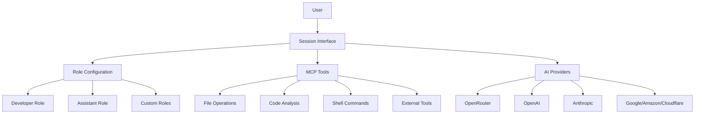

# Octomind - AI-Powered Development Assistant

**© 2025 Muvon Un Limited (Hong Kong)** | Contact: [opensource@muvon.io](mailto:opensource@muvon.io) | Website: [muvon.io](https://muvon.io) | Product: [octomind.muvon.io](https://octomind.muvon.io)

Octomind is a session-based AI development assistant that helps you understand and work with your codebase through interactive conversations. Built with a simplified, session-first approach, it provides intelligent code assistance with built-in tools for file operations, code analysis, and development tasks.

## Core Principles

### 🎯 Session-First Architecture
Everything happens within interactive AI sessions. No separate indexing or search commands - just natural conversation with AI assistants that have built-in development tools.

### 🔧 Role-Based Configuration
- **Developer Role**: Full development environment with all tools enabled
- **Assistant Role**: Simple conversation mode without development tools
- **Custom Roles**: User-defined specialized configurations

### 🛠️ Built-in Development Tools
File operations, code analysis, and shell command execution via MCP (Model-Centric Programming) protocol - all accessible through natural conversation.

### 🌐 Multiple AI Provider Support
OpenRouter, OpenAI, Anthropic, Google Vertex AI, Amazon Bedrock, Cloudflare Workers AI with unified `provider:model` format.

## Quick Start

### Installation

```bash
# Quick install (recommended)
curl -fsSL https://raw.githubusercontent.com/muvon/octomind/main/install.sh | bash

# Or build from source
git clone https://github.com/muvon/octomind.git
cd octomind && cargo build --release
```

### Setup

```bash
# Set your AI provider API key
export OPENROUTER_API_KEY="your_key"  # or OPENAI_API_KEY, ANTHROPIC_API_KEY, etc.

# Create configuration
octomind config

# Start your first session
octomind session
```

### Basic Usage

```bash
# Start development session (includes all tools)
octomind session

# Start simple chat session (no tools)
octomind session --role=assistant

# Resume a session
octomind session --resume my_session

# Use specific model
octomind session --model "openrouter:anthropic/claude-sonnet-4"
```

## How It Works

Instead of complex command-line tools, simply talk to Octomind:

```
> "How does authentication work in this project?"
[AI analyzes project structure, finds auth-related files, explains implementation]

> "Add error handling to the login function"
[AI examines login code, implements error handling, shows changes]

> "Why is the build failing?"
[AI checks build errors, analyzes code, suggests fixes]
```

### Session Commands

Within any session, use these commands:
- `/help` - Show available commands
- `/model [model]` - Show/change current model
- `/info` - Display token usage and costs
- `/cache` - Mark cache checkpoint for cost savings
- `/done` - Optimize context and restart layered processing
- `/exit` - Exit session

## Key Features

- **Interactive AI Sessions**: Work with your codebase through natural conversation
- **Project Context Awareness**: Automatic project analysis and context collection
- **Layered Architecture**: Multi-stage AI processing for complex development tasks
- **Token Management**: Cost tracking, caching, and automatic context optimization
- **Session Management**: Save, resume, and organize development conversations
- **Extensible Tool System**: MCP protocol support for integrating external tools

## Documentation

📖 **[Complete Documentation](./doc/README.md)** - Comprehensive guides and references

### Quick Links
- **[Installation Guide](./doc/01-installation.md)** - Detailed installation methods, cross-compilation, shell completions
- **[Configuration Guide](./doc/02-configuration.md)** - Configuration system and settings
- **[Provider Setup](./doc/03-providers.md)** - AI provider setup and management
- **[Session Guide](./doc/05-sessions.md)** - Interactive sessions and modes
- **[Advanced Features](./doc/06-advanced.md)** - MCP tools, layered architecture, and extensibility

## Configuration Example

```toml
# .octomind/config.toml
[providers.openrouter]
api_key = "your_key"  # Or use environment variable

[developer]
model = "openrouter:anthropic/claude-sonnet-4"
enable_layers = true

[assistant]
model = "openrouter:anthropic/claude-3.5-haiku"
enable_layers = false

[assistant.mcp]
enabled = false  # Disable tools for simple chat
```

## Supported AI Providers

| Provider | Format | Features |
|----------|--------|----------|
| OpenRouter | `openrouter:provider/model` | Multi-provider access, caching |
| OpenAI | `openai:model-name` | Direct API, cost calculation |
| Anthropic | `anthropic:model-name` | Claude models, caching |
| Google | `google:model-name` | Vertex AI, multimodal |
| Amazon | `amazon:model-name` | Bedrock models, AWS integration |
| Cloudflare | `cloudflare:model-name` | Edge AI, fast inference |

## Architecture



## Contributing

Contributions are welcome! Please feel free to submit a Pull Request.

- **Adding New AI Providers**: See `src/session/providers/` for examples
- **Adding New MCP Tools**: Configure via MCP server registry or add to existing servers
- **Documentation Updates**: Update both code and documentation

```bash
# Development setup
cargo test
cargo build
make install
```

## Troubleshooting

### Common Issues
- **Configuration Errors**: Run `octomind config --validate`
- **Missing API Keys**: Set environment variables for your AI provider
- **Invalid Model Format**: Use `provider:model` format (e.g., `openrouter:anthropic/claude-sonnet-4`)
- **Session Issues**: Use `/debug` to enable detailed logging

### Getting Help
- **Issues**: [GitHub Issues](https://github.com/muvon/octomind/issues)
- **Documentation**: [Complete Documentation](./doc/README.md)
- **Email**: [opensource@muvon.io](mailto:opensource@muvon.io)

## 📞 Support & Contact

- **Issues**: [GitHub Issues](https://github.com/muvon/octomind/issues)
- **Email**: [opensource@muvon.io](mailto:opensource@muvon.io)
- **Company**: Muvon Un Limited (Hong Kong)
- **Website**: [muvon.io](https://muvon.io)
- **Product Page**: [octomind.muvon.io](https://octomind.muvon.io)

## ⚖️ License

Copyright © 2025 Muvon Un Limited. All rights reserved.

This project is licensed under the Apache License 2.0 - see the [LICENSE](LICENSE) file for details.
