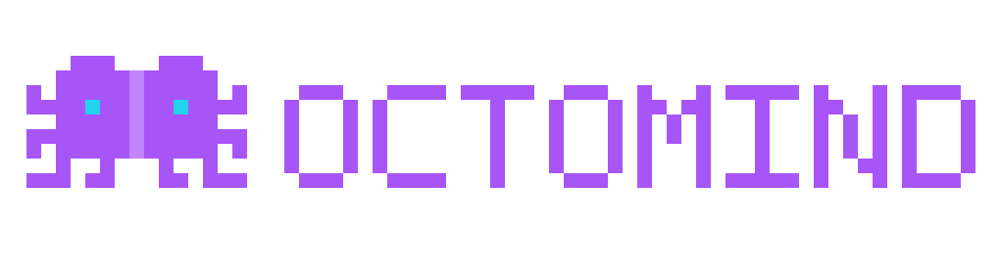

<div align="center">
  <a href="https://octomind.run" target="_blank">
    
  </a>
  <br /><br />
  <strong>The CLI-first AI agent runtime.</strong><br />
  <em>Pipe it, schedule it, embed it. One binary, any model, MCP-native — built for autonomous work, not just chat.</em>
  <br /><br />

  [](LICENSE)
  [](https://crates.io/crates/octomind)
  [](https://github.com/muvon/octomind/stargazers)
  [](https://octomind.run)

  <br />

  [Documentation](https://octomind.run/docs/) · [Tap Registry](https://github.com/muvon/octomind-tap) · [Website](https://octomind.run)
</div>

---

Octomind is an open-source AI agent client: the model calls MCP tools to do real work — read and write files, run shells, search code, delegate to sub-agents. Most agent CLIs are chat interfaces that happen to run in a terminal. Octomind is a runtime that happens to have one: the same session runs **interactively**, **piped through stdin**, as a **background daemon**, over **WebSocket**, or as an **ACP sub-agent** inside another agent's stack. Models, tools, roles, guardrails, budgets — all of it is TOML, no framework code.

```bash
# Interactive
octomind run developer:general

# Piped — CI, scripts, automation
echo "Explain the auth module" | octomind run developer:general --format plain

# Daemon — long-running, inject messages from anywhere
echo "watch the build" | octomind run --name watcher --daemon --format jsonl
octomind send --name watcher "run the test suite"
```

## Table of Contents

- [Quick Start](#quick-start)
- [Benchmarks — Real PRs, Held-Out Tests](#benchmarks--real-prs-held-out-tests)
- [Why Octomind?](#why-octomind)
- [One Binary, Five Surfaces](#one-binary-five-surfaces)
- [Guardrails — Policy as Code](#guardrails--policy-as-code)
- [Cost as a Control Plane](#cost-as-a-control-plane)
- [Sessions That Stay Sharp at Hour 4](#sessions-that-stay-sharp-at-hour-4)
- [Intent-Driven Context](#intent-driven-context)
- [Specialists & Taps](#specialists--taps)
- [Built-in MCP Tools](#built-in-mcp-tools)
- [Power Users — Roles, Workflows, Layers](#power-users--roles-workflows-layers)
- [Installation](#installation)
- [Configuration](#configuration)
- [Architecture](#architecture)
- [Contributing](#contributing)
- [Documentation](#documentation)
- [License](#license)

---

## Quick Start

```bash
# Install (macOS & Linux) — single Rust binary, no runtime dependencies
curl -fsSL https://raw.githubusercontent.com/muvon/octomind/master/install.sh | bash

# Sign in — models included, no API keys to manage
octomind login

# Start with a specialist — no setup required
octomind run developer:general
```

```
        Octomind v0.40.2
        Role: developer · Model: octohub:auto
        ~/your/project
> _
```

You're in a session with an agent that can read your code, run commands, edit files, and grow capabilities as needed. Plain-line interface with markdown rendering and shell completions — no TUI to learn, works over SSH, in `tmux`, in CI logs.

`octomind login` connects you to [Octomind Cloud](https://octomind.run/cloud) — a subscription that includes model access through the octohub gateway, so there's nothing to configure. Prefer your own keys? Skip login entirely and [bring any provider](#model-access): OpenRouter, Anthropic, OpenAI, DeepSeek, Ollama, and more. Cloud is the baseline; BYOK is always a first-class path.

> `developer:general` (and `lawyer:sg`, `doctor:blood`, …) come from the built-in default tap [`muvon/tap`](https://github.com/muvon/octomind-tap), not your local config. The config's own default tag is `assistant:concierge`, so plain `octomind run` starts that. The banner above is illustrative (the real one renders a pixel icon to the left of the text block).

Other installs: `cargo install octomind` (Rust 1.95+) or [build from source](#installation).

---

## Benchmarks — Real PRs, Held-Out Tests

We benchmark on [octobench](https://github.com/Muvon/octobench): **25 tasks harvested from pull requests merged in 2026** — mostly after model training cutoffs — across python, php, rust, c++, and js. Each agent works in the pre-fix repo; the merged fix's own maintainer-written tests (which the agent never sees) decide pass or fail. Four agents, stock single-agent invocations, no tuning:

| | solved | judge Σ / 2500 | cost | wall time |
|---|---|---|---|---|
| **octomind + glm-5.2** | **24/25** | **2264** | $63.43 | 3.6h |
| claude code + claude-opus-5 | 23/25 | 2262 | $81.79 | 6.7h |
| codex + gpt-5.6-sol | 21/25 | 2127 | $14.86 | 1.0h |
| opencode + glm-5.2 | 19/25 | 2093 | $129.54 | 3.3h |

- **The harness is the leverage.** opencode ran the same model on the same endpoint at the same prices — a pure harness A/B. octomind solved 24 vs 19, at half the cost: context discipline plus supervision on exactly the deep-root-cause tasks where unsupervised agents declare victory too early.
- **Worst-case pricing, still ahead.** glm-5.2 ran without prompt caching (every token at list price) while Opus billed ~97% of context re-reads at 1/10 cache rates — and octomind still led on solves, cost, and wall time.
- **Reproducible.** Full per-case table, run artifacts, and reproduction guide: [BENCHMARK.md @ 8aa3968](https://github.com/Muvon/octobench/blob/8aa39684ff6103782aacb1bd79ea98e96e50d6cf/BENCHMARK.md). The story behind the benchmark: [blog post](https://octomind.run/blog/coding-agent-benchmark-real-prs).

---

## Why Octomind?

Agent CLIs in 2026 all do interactive chat well. The gaps open up the moment you leave the keyboard:

- **Autonomy needs policy, not popups.** Other CLIs make the human the safety layer — every dangerous call waits for an approval click. That breaks in CI, daemons, and scheduled runs. Octomind enforces deterministic guardrails from a TOML file instead. See [Guardrails](#guardrails--policy-as-code).
- **Config wars.** No central registry. Skills here, MCP servers there, agent configs nowhere. The community calls it ["solidarity in frustration."](https://dev.to/satinathnit/the-agent-config-wars-why-your-ai-agent-documentation-is-already-obsolete-4d6i) Octomind ships a tap registry: each agent is one TOML file in a Git repo, `octomind run category:variant` and it works.
- **Generic AI hallucinates in expert domains.** ChatGPT writes wrong drug dosages. Lawyers cite cases that don't exist. Multi-agent specialization is now [the default architecture](https://dev.to/aibughunter/ai-agents-in-april-2026-from-research-to-production-whats-actually-happening-55oc) for serious work — Octomind runs packaged specialists, one command each.
- **One generic assistant for every task.** Rust debugging, blood-test interpretation, contract review — same prompt, same tools. Drift compounds.
- **Sessions break at hour 4.** Naive truncation drops the decisions you need. Quality collapses. You restart. Octomind's compaction is cache-aware and structurally preserving. See [Sessions](#sessions-that-stay-sharp-at-hour-4).
- **Bills surprise you.** Cursor users posting $7K daily overages. No per-task budget, no kill switch. Octomind enforces hard spending caps — before the bill, not after. See [Cost](#cost-as-a-control-plane).
- **Context is preloaded and bloated.** Most harnesses load every tool and skill up front. Octomind activates skills and capabilities on intent. See [Intent-Driven Context](#intent-driven-context).

| Pillar | What it gives you |
|---|---|
| **Zero config, full flexibility** | `octomind run lawyer:sg` works out of the box. Need a different model, MCP server, or guardrail pipe? Same TOML, no framework code. |
| **Sessions stay sharp at hour 4** | Adaptive compaction: cache-aware, structurally preserving. Smaller context = faster responses + lower cost. |
| **Cost as a control plane** | Per-step model selection across many providers. Hard spending caps and cache-aware accounting come for free. |
| **Guardrails: policy as code** | Govern autonomous agents with deterministic scripts — pre-call guards, post-result hooks, post-turn validators. No modal approval clicks. Fits CI. |
| **Intent-driven context** | Skills and capabilities activate only when what you're asking for matches them. Smaller context by default, lower cost, no surprise tools. |

---

## One Binary, Five Surfaces

The same session engine, exposed however your workflow needs it:

| Mode | Use for |
|---|---|
| Interactive CLI | Daily work, any domain |
| `octomind run --format` pipe | CI/CD pipelines, shell scripts, automation |
| `octomind run --daemon` + `octomind send` | Background agents, continuous monitoring, long-running tasks |
| WebSocket server (`octomind server`) | IDE plugins, web dashboards, external integrations |
| ACP protocol (`octomind acp`) | Multi-agent orchestration, being called by other agents |

```bash
# ACP — drop into any multi-agent system as a sub-agent
octomind acp developer:general

# Non-interactive — the message is read from stdin (pipe it in), output as plain text
echo "Explain the auth module" | octomind run developer:general --format plain

# Structured JSONL output for pipelines
echo "List TODO items" | octomind run developer:general --format jsonl

# Daemon — keep a session alive and inject messages into it from anywhere
echo "first task" | octomind run --name watcher --daemon --format jsonl
octomind send --name watcher "now run the test suite"

# Structured output — constrain replies to a JSON Schema (structured-output models only)
echo "List TODO items as JSON" | octomind run developer:general --format jsonl --schema todos.schema.json
```

`octomind run` has **no message argument** — when `--format` is set, input comes from piped stdin. `--format` is `run`-only (it accepts only `plain` or `jsonl`; `server` and `acp` do not take it). Setting `--format` triggers non-interactive mode only when stdin is *not* a terminal: `octomind run developer:general --format plain` typed at a TTY stays interactive, while piping into it runs once and exits. Pass `--schema <file.json>` to force replies to match a JSON Schema (requires a structured-output-capable model — Anthropic models error out); see the [CLI reference](doc/reference/01-cli-reference.md).

See [WebSocket Server](doc/integration/01-websocket-server.md), [ACP Protocol](doc/integration/02-acp-protocol.md), and [Daemon & Hooks](doc/integration/03-daemon-and-hooks.md) for the integration modes.

One binary. Every workflow.

---

## Guardrails — Policy as Code

Other agent CLIs make the human the safety layer: every dangerous tool call pops a modal, every file write waits for a click. That works for one developer at the keyboard. It breaks the moment you point an agent at a long-running task, a CI job, or an autonomous loop.

Octomind takes the opposite position. **Policy lives in scripts, not prompts.** Drop a `.agents/guardrails.toml` in your repo and the runtime enforces it deterministically — pre-call, post-result, post-turn.

```toml
# Pre-call deny — block a class of calls before they execute
[[guard]]
match   = "shell(command=^rm\\s+-rf?)"
message = "rm -rf blocked."

# Conditional rule — only fires after the agent ran git status this session
[[guard]]
match   = "shell(command=git push)"
when    = ["+shell(command=git status)"]
message = "Review changes before pushing."

# Post-result hook — non-zero exit injects feedback into the agent's inbox
[[hook]]
match  = "text_editor(path=src/.*\\.rs)"
on     = "success"
script = ".agents/check-clippy.sh"

# Post-turn validator — fires only over the call slice since it last ran
[[validator]]
name   = "tests-pass"
roles  = ["developer"]
script = ".agents/run-tests.sh"
```

- **Guards** — pre-call deny rules. Match by `capability(arg_name=regex)`, gate by history (`+used` / `-unused`), require loaded capabilities (`has = [...]`). The agent never even attempts a blocked call.
- **Hooks** — post-result scripts. Run after each tool returns. Non-zero exit injects stdout into the agent's inbox as a user message — clippy errors, lint failures, format diffs become *automatic corrections without restarting the turn*.
- **Validators** — post-turn scripts. Fire only over the new call-log slice (cursor-based, never re-fires on old activity). Filter by role. Output is wrapped in `<validation>` blocks the agent reads on its next turn. **This is what replaces "approve this change?" prompts in autonomous loops.**

The DSL is richer than competitor lifecycle hooks: capability+arg-regex+history+role+result-regex in one declarative file. No code to compile, no plugin to install. **Designed for full automation: fits CI, daemons, scheduled runs, ACP sub-agents.** Full reference: [Guardrails](doc/usage/18-guardrails.md).

> The world is going autonomous. The choice isn't "ask vs auto" — it's "auto with deterministic policy" vs "auto with hope." Octomind ships the former.

---

## Cost as a Control Plane

Pick the right model for each step. A cheap one for routine research, a frontier one for review — per-role, per-step, mid-session swap. Real-time cost tracking and hard spending caps come for free.

```toml
# Per-role model selection — pay Opus only where it's worth it
[[roles]]
name = "researcher"
model = "openrouter:google/gemini-2.5-flash"   # cheap broad context

[[roles]]
name = "reviewer"
model = "anthropic:claude-opus-4-7"            # precision where it counts

# Hard spending limits — enforced, not advisory
max_request_spending_threshold = 0.50    # USD per request
max_session_spending_threshold = 5.00    # USD per session
```

- Per-role and per-layer model selection across many providers — OpenRouter, OpenAI, Anthropic, Google, DeepSeek, Amazon Bedrock, Cloudflare, and more — via [octolib](https://github.com/muvon/octolib). Different roles can run on different vendors; new providers added there become available in Octomind automatically. See [Providers & Models](doc/usage/04-providers.md) for the current list and supported models.
- Mid-session model swap with `/model anthropic:claude-haiku-4-5`. Mix providers across roles — cheap model for research, best model for execution. Cost tracked separately per provider.
- Real-time cost tracking per request and per session.
- Cache-aware token accounting (`cache_read_tokens`, `cache_write_tokens` separated from input/output).
- Hard spending thresholds with enforcement. On a **session cap** Octomind prompts you to continue (interactive) or auto-stops (non-interactive); on a **request cap** it stops execution outright — before the bill, not after.

> Cursor users get $7,000 surprise bills. Octomind agents trip a budget and stop — interactive sessions ask before continuing, non-interactive runs halt automatically.

---

## Sessions That Stay Sharp at Hour 4

Every coding agent degrades after a few hours. Context fills. Decisions get truncated. The agent forgets why it started.

Octomind's adaptive compaction engine runs automatically:

- **Cache-aware** — calculates if compaction is worth it *before* paying for it. Never breaks the prompt-cache hit by accident.
- **Pressure-tiered** — compacts more aggressively as context grows.
- **Structurally preserving** — keeps decisions, file references, errors, dependencies; drops noise.
- **Adaptively plan-aware** — the supervisor tracks complex work externally while focused tasks remain plan-free.
- **Fully automatic** — you never think about it.

The second-order benefit: smaller context means **fewer tokens, faster responses, lower cost** every turn after compaction fires.

Sessions also persist: `octomind run --name my-feature` saves as you go, `octomind run --resume my-feature` (or `--resume-recent`) picks up where you left off — including multi-day tasks. Details: [Compression](doc/usage/08-compression.md), [Sessions](doc/usage/05-sessions.md).

> Work on a hard problem for 4 hours. The agent still knows what it decided in hour one.

---

## Intent-Driven Context

Most agent harnesses pre-load every available tool, every skill, every instruction pack into context up front. The model sees fifty tool definitions and a wall of system prompts before you type a single character. **Token bills follow. Cache misses follow. Confused tool selection follows.**

Octomind inverts this. Skills and capabilities sit dormant until your intent matches them — then they activate, inject their content, and stay only as long as they're relevant. **Context is a function of what you're actually trying to do.**

### How activation works (no keyword guessing)

- **Meaning, not keywords.** A dedicated embedding model — trained on activation traffic — scores how well your request matches each skill's description. "Help me refactor this auth flow" and "the login is broken" both find the same skill; "what's the weather" finds none.
- **Hand-authored rules where precision matters.** Skill authors can pin activation to file names, file contents, or exact phrases when they know better than a similarity score.
- **Abstain on near-ties.** When two skills score close, **neither fires.** Better to load nothing than the wrong thing.
- **Calibrated to skip, not guess.** Wrong activations bloat context and waste tokens. The system defaults to silence when in doubt.

### Why this matters

```
Other agent CLIs:                       Octomind:
─────────────────────                   ──────────
1. User starts session                  1. User starts session
2. Load 50 tools into context           2. Load 5 core tools into context
3. Load 30 skills into system prompt    3. Skills sit dormant
4. User types one sentence              4. User types one sentence
5. Model picks tool from a wall         5. Embed model scores → 1 skill matches
                                           → skill content injected
                                           → 6 tools in context, not 80
                                        6. Skill goes silent again when no longer relevant
```

**Smaller context = faster first token, lower cost per turn, fewer wrong tool calls.**

It compounds with the rest:

- **`mcp` mid-session.** Even when a skill activates, the underlying MCP server only spins up if the skill actually calls it. Inactive servers = zero token cost.
- **Compression interplay.** A deactivated skill is dropped during compaction — its content is recoverable on next activation, not pinned forever.
- **Guardrails.** A guard can require `has = ["filesystem-read"]` and only fire when that capability is currently loaded. Policy and activation share the same capability namespace.

Details: [Skills](doc/usage/15-skills.md), [Token Efficiency](doc/usage/16-token-efficiency.md).

> Most "agentic" CLIs pretend context is free. Octomind treats it as the scarcest resource in the system — and only spends it on what you actually meant.

---

## Specialists & Taps

`octomind run <tag>` resolves a **specialist** — a packaged agent with its model config, system prompt, MCP servers, and tool permissions. Not a prompt file, not a skill injection — the full stack, configured by the community, ready to run.

```bash
octomind run developer:general    # general dev, language skills auto-activate
octomind run doctor:blood         # blood-test interpretation specialist
octomind run doctor:nutrition     # nutrition specialist
```

What happens when you run a specialist:

```
→ Fetches the agent manifest from the tap registry
→ Installs required binaries automatically (skips if already present)
→ Prompts once for any credentials, saves permanently
→ Spins up the right MCP servers for this domain
→ Loads specialist model config, system prompt, tool permissions
→ Ready in ~5 seconds, not 45 minutes
```

### Specialists grow at runtime

Every agent has built-in power tools that let it acquire new capabilities and spawn sub-agents mid-session, without restart:

| Tool | What it does |
|---|---|
| `tap` | Delegate to any specialist role from the tap registry. Foreground for an inline reply or background for long tasks. |
| `mcp` | Enable or disable MCP servers on the fly. Agent picks the server it needs and registers it mid-conversation. |
| `agent` | Spawn a specialist sub-agent for a sub-task. Sub-agent runs, returns, parent continues. |

```
User: "Cross-reference our Postgres metrics with the deployment log"

Agent:
  → mcp.enable(postgres-mcp)        # auto-detected need, no user prompt
  → agent.spawn(log_reader)         # delegates log parsing
  → results merge mid-session
  → mcp.disable(postgres-mcp)       # cleans up
  → presents the analysis
```

Most agent harnesses pre-load every available tool into context. Octomind starts focused for the domain and grows only when needed. **Smaller context, lower cost, faster responses, no surprise tools.** See [Intent-Driven Context](#intent-driven-context) for how activation actually works.

### Add your own taps

```bash
octomind tap yourteam/tap                 # clones github.com/yourteam/octomind-tap
octomind tap yourteam/internal ~/path     # local tap for private agents

octomind run finance:analyst              # available immediately
octomind run security:owasp
```

Each tap is a Git repo. Each agent is one TOML file. Pull requests are contributions.

> Want to publish your expertise? A `doctor:medications`, a `lawyer:us`, a `devops:terraform`. One file, and everyone with that problem gets a specialist instantly. [How to write a tap agent →](https://github.com/muvon/octomind-tap)

---

## Built-in MCP Tools

Octomind is MCP-native in both directions: it's a **client** that consumes any MCP server (stdio, Streamable HTTP, OAuth), and it exposes its own built-in servers.

The runtime can expose these according to the active role and configuration. Planning is not a model-callable tool: the supervisor owns it externally, while `/plan` remains a read-only display command.

| Tool | Purpose |
|---|---|
| `mcp` | Enable/disable MCP servers at runtime |
| `agent` | Spawn specialist sub-agents mid-session |
| `schedule` | Inject messages at future times |
| `monitor` | React to event-stream scripts without active polling |
| `skill` | Inject reusable instruction packs from taps |
| `tap` | Delegate to any specialist role from a tap registry |
| `capability` | Auto-activate capabilities by semantic intent matching |

### Filesystem tools (via [octofs](https://github.com/muvon/octofs))

`view`, `text_editor`, `batch_edit`, `extract_lines`, `shell`, `ast_grep`, `list_files`, `workdir` — file operations come from the companion octofs MCP server (`ast_grep` is its AST-based code search). Included by default in tap formulas that need them.

### Brain (via [octobrain](https://github.com/muvon/octobrain))

`memorize`, `remember`, `forget`, `knowledge`, `relate`, `memory_graph` — long-term memory, knowledge indexing, and relationship graphs. The companion octobrain MCP server is included by default in taps that need persistent context across sessions.

> **Only `core`, `runtime`, and `agent` are built-in MCP servers** shipped in the default config. The `filesystem` (octofs) and `brain` (octobrain) servers are supplied by tap formulas — a freshly generated config won't list them.

### Local project tools

Drop executable shebang scripts into `<workdir>/.agents/tools/` and they're auto-discovered as MCP tools for that project. See [Local Tools](doc/usage/17-local-tools.md).

---

## Power Users — Roles, Workflows, Layers

For most users, taps are enough. For teams and power users, the configuration system is deep — **all TOML, no code**.

```toml
# Per-role: independent model, temperature, MCP servers, tools, system prompt
[[roles]]
name = "senior-reviewer"
model = "anthropic:claude-opus-4-7"
temperature = 0.2
[roles.mcp]
server_refs = ["filesystem", "github"]
# view/ast_grep are octofs (filesystem) tools; create_pr comes from the github MCP server
allowed_tools = ["view", "ast_grep", "create_pr"]

# Sandbox — lock all writes to current directory
sandbox = true
```

```bash
# Workflows — multi-step, each step its own model and toolset
# Defined in standalone TOML files, run via CLI
octomind workflow deep_review.toml
```

- **Roles** — model, temperature, system prompt, MCP servers, tool permissions per role.
- **Layers** — chained AI sub-agents that run after each response.
- **Guardrails** — deterministic policy (guards, hooks, validators) and input pipes.
- **Workflows** — multi-step orchestrated task runners with validation loops.
- **Supervisor** — out-of-band control plane: loop/no-progress detectors, verify-gate on self-reported `done`, cross-session learning. See [Supervisor](doc/usage/14-supervisor.md).

See [Configuration Reference](doc/reference/03-config-reference.md) for everything.

---

## Installation

### One-line install

```bash
curl -fsSL https://raw.githubusercontent.com/muvon/octomind/master/install.sh | bash
```

Detects OS and architecture, installs to `~/.local/bin/`. macOS and Linux supported. Single Rust binary, no runtime dependencies.

### Cargo

```bash
cargo install octomind
```

Requires Rust 1.95+. See [Building from Source](doc/dev/01-building-from-source.md).

### Build from source

```bash
git clone https://github.com/muvon/octomind.git
cd octomind
cargo build --release
```

### Model access

**Option A — Octomind Cloud (recommended).** One subscription, all models, zero keys:

```bash
octomind login
```

Device-code sign-in (like `gh auth login`). This mints an octohub gateway key locally — the default config already routes every request through it (`model = "octohub:auto"`), so you're done. Learn more: [octomind.run/cloud](https://octomind.run/cloud).

**Option B — bring your own keys.** Octomind is fully open source and works standalone with any provider:

```bash
# OpenRouter — access to many providers with one key
export OPENROUTER_API_KEY="your_key"

# Or any specific provider
export OPENAI_API_KEY="your_key"
export ANTHROPIC_API_KEY="your_key"
export DEEPSEEK_API_KEY="your_key"
```

Add to `~/.bashrc` or `~/.zshrc` for persistence. Not signed in is a normal state, not an error — then set `model = "openrouter:..."` (or any provider) in your config.

### Verify

```bash
octomind --version
octomind config       # generate default config
octomind run          # start your first session
```

---

## Configuration

Config lives at `~/.local/share/octomind/config/config.toml`.

```bash
octomind config --show          # view current config
octomind config --validate      # validate config
```

Key areas:

- **Roles** — model, temperature, system prompt, MCP servers, tool permissions
- **Workflows** — multi-step AI processing with validation loops
- **Guardrails** — deterministic policy (guards, hooks, validators) and input pipes
- **MCP Servers** — external tools and capabilities
- **Spending Limits** — per-request and per-session thresholds
- **Telemetry** — anonymous usage stats, on by default

Full reference: [Configuration Reference](doc/reference/03-config-reference.md).

### Telemetry

Octomind reports anonymous usage — which commands, tools and models get used,
plus timings, token counts and error kinds. Never your code, prompts, file
paths, tool arguments or environment values. Turn it off any of three ways:

```bash
export DO_NOT_TRACK=1           # the cross-tool standard, honoured first
export OCTOMIND_TELEMETRY=0     # per-run
# or set `telemetry = false` in config.toml
```

Exact field list: [Telemetry](doc/reference/04-environment-variables.md#telemetry).

### Session commands

| Command | Description |
|---|---|
| `/help` | Show all commands |
| `/info` | Token usage and costs |
| `/model <provider:model>` | Switch model mid-session |
| `/effort <level>` | Set reasoning effort (low/medium/high/xhigh/max) |
| `/role <name>` | Switch role mid-session |
| `/session` | Manage saved sessions (sessions auto-save) |
| `/done` | Finalize the current task: compress context, run learning extraction, summarize |
| `/exit` | Exit session |

Full list: [Session Commands](doc/reference/02-session-commands.md).

---

## Architecture

One binary. The session is the unit of work. Around it: roles (who's talking), layers and workflows (multi-step orchestration), guardrails with pipes (deterministic pre-processing and policy), adaptive compaction (long-session quality), and MCP servers (tools). All of it driven by a single resolved TOML config — no hardcoded behavior, no framework code to edit.

Embedders pick their surface: interactive CLI, ACP for multi-agent orchestration, WebSocket for IDEs and dashboards, daemon mode for long-running background agents.

See [Architecture](doc/dev/02-architecture.md) for internals.

---

## Contributing

The most impactful contribution isn't code — **it's specialist agents.**

Every domain expert who publishes a specialist makes Octomind useful for an entirely new audience. A cardiologist publishing `doctor:medications`. A tax attorney publishing `lawyer:us`. A security researcher publishing `security:owasp`. One TOML file — and everyone with that problem gets a specialist-grade AI instantly.

- [How to write a tap agent](https://github.com/muvon/octomind-tap)
- [Open issues](https://github.com/muvon/octomind/issues)
- [Building from source](doc/dev/01-building-from-source.md)
- [Contributing guide](CONTRIBUTING.md)

---

## Documentation

- [Installation & Setup](doc/usage/01-installation.md)
- [Quickstart](doc/usage/02-quickstart.md)
- [Configuration](doc/usage/03-configuration.md)
- [Providers & Models](doc/usage/04-providers.md)
- [Sessions](doc/usage/05-sessions.md)
- [Compression](doc/usage/08-compression.md)
- [Roles](doc/usage/06-roles.md)
- [MCP Tools](doc/usage/07-mcp-tools.md)
- [Workflows](doc/usage/09-workflows.md)
- [Guardrails](doc/usage/18-guardrails.md)
- [Skills](doc/usage/15-skills.md)
- [Supervisor](doc/usage/14-supervisor.md)
- [Learning](doc/usage/13-learning.md)
- [WebSocket Server](doc/integration/01-websocket-server.md)
- [ACP Protocol](doc/integration/02-acp-protocol.md)
- [CLI Reference](doc/reference/01-cli-reference.md)
- [Config Reference](doc/reference/03-config-reference.md)

Links above are local files in this repo; the [hosted docs site](https://octomind.run/docs/) mirrors them. Full index: [doc/README.md](doc/README.md).

---

## License

Apache License 2.0 — see [LICENSE](LICENSE).

---

**Octomind** by [Muvon](https://muvon.io) | [Website](https://octomind.run) | [Documentation](https://octomind.run/docs/)
