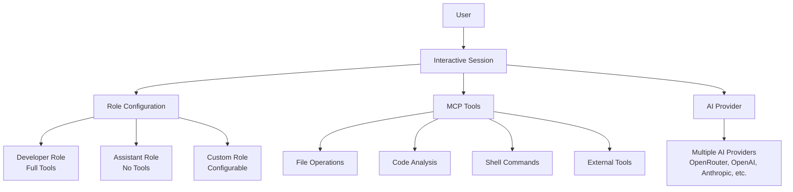

# Octodev Overview

## What is Octodev?

Octodev is a session-based AI development assistant written in Rust that helps developers understand and work with their codebase through natural conversation. Built with a simplified, session-first approach, it provides intelligent code assistance through built-in tools for file operations, code analysis, and development tasks.

## Simplified Architecture

Octodev has been redesigned around a core principle: **everything happens within interactive AI sessions**. Gone are the separate command-line tools for indexing and searching. Instead, all functionality is accessible through natural conversation with AI assistants that have built-in development tools.

### Session-First Design



## Core Components

### 1. Session Management
- **Interactive conversations** with AI assistants
- **Session persistence** - save, resume, and organize conversations
- **Role-based configuration** - different behavior for different use cases
- **Context management** - automatic optimization and token management

### 2. MCP Tool Integration
Development tools are provided through the MCP (Model-Centric Programming) protocol:
- **File Operations**: Read, write, edit files with AI assistance
- **Code Analysis**: Understand code structure and relationships
- **Shell Commands**: Execute development commands when needed
- **External Tools**: Integrate with external MCP servers

### 3. Role-Based Configuration
- **Developer Role**: Full development environment with all tools enabled
- **Assistant Role**: Simple conversation mode without development tools
- **Custom Roles**: User-defined roles with specific tool configurations

### 4. AI Provider Support
Extensive support for multiple AI providers with unified interface:
- OpenRouter (multi-provider access)
- OpenAI, Anthropic, Google Vertex AI
- Amazon Bedrock, Cloudflare Workers AI

### 5. Layered Architecture
For complex development tasks, an optional multi-stage processing system:
- **Query Processor**: Improves and clarifies user requests
- **Context Generator**: Gathers necessary code context using tools
- **Developer**: Implements solutions and produces responses
- **Reducer**: Optimizes context (manual trigger via `/done`)

## Key Features

### 1. Natural Conversation Interface
Instead of complex command-line options, simply talk to Octodev:
- **"How does authentication work in this project?"**
- **"Show me the main configuration files"**
- **"Help me fix this compilation error"**
- **"Add error handling to the login function"**

### 2. Intelligent Project Understanding
Sessions automatically analyze your project context:
- **Project structure** and organization
- **Code relationships** and dependencies
- **Configuration files** and settings
- **Documentation** and README files

### 3. Built-in Development Tools
All tools are accessible through natural conversation:
- **File operations**: View, edit, create files
- **Code analysis**: Understand structure and relationships
- **Shell commands**: Execute development tasks
- **Search capabilities**: Find code by meaning

### 4. Flexible Role System
Choose the right mode for your needs:
- **Developer Role**: Full development environment
- **Assistant Role**: Simple chat without tools
- **Custom Roles**: Define your own specialized configurations

### 5. Session Management
Organize your development conversations:
- **Save and resume** development sessions
- **Context optimization** for long conversations
- **Token management** and cost tracking
- **Session switching** for different projects

## How to Use Octodev

### Basic Workflow

1. **Start a session**: `octodev session`
2. **Ask questions**: Natural language about your code
3. **Get assistance**: AI helps with analysis and modifications
4. **Continue working**: Session maintains context and history

### Example Interactions

```
> How is user authentication implemented?

[AI analyzes project structure, finds auth-related files, explains the implementation]

> Can you add rate limiting to the login endpoint?

[AI examines the login code, implements rate limiting, shows the changes]

> Why is the build failing?

[AI checks build errors, analyzes the code, suggests fixes]
```

## Getting Started

### Quick Setup

1. **Install Octodev**
   ```bash
   # Quick install script
   curl -fsSL https://raw.githubusercontent.com/muvon/octodev/main/install.sh | bash
   
   # Or build from source
   git clone https://github.com/muvon/octodev.git
   cd octodev
   cargo build --release
   ```

2. **Configure AI Provider**
   ```bash
   # Set your API key (choose one)
   export OPENROUTER_API_KEY="your_key"
   export OPENAI_API_KEY="your_key"
   export ANTHROPIC_API_KEY="your_key"
   
   # Create configuration
   octodev config
   ```

3. **Start Your First Session**
   ```bash
   # Start in your project directory
   cd your_project
   octodev session
   ```

### What's Different

Octodev now uses a simplified, session-first approach:

```bash
# Everything in one place
octodev session

# Then just ask naturally:
> "How does auth work in this project?"
> "Add error handling to login"
> "Why is the build failing?"
```

No separate indexing or search commands needed.

## Next Steps

- [Configuration Guide](./02-configuration.md) - Set up providers and roles
- [Provider Setup](./03-providers.md) - Configure AI models
- [Session Guide](./05-sessions.md) - Master interactive sessions
- [Advanced Features](./06-advanced.md) - Layered architecture and MCP tools