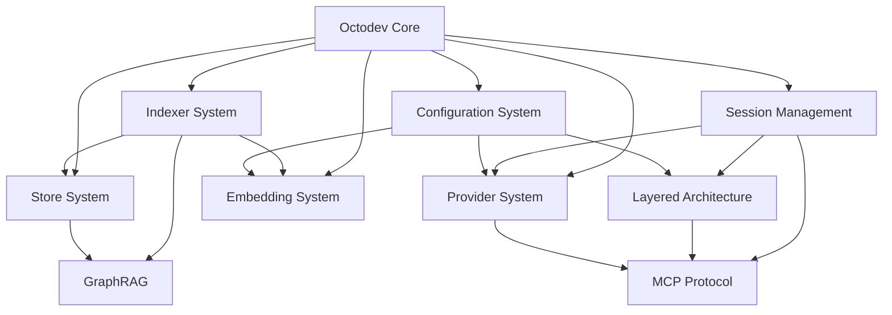

# Octodev Overview

## What is Octodev?

Octodev is a smart codebase assistant written in Rust that helps developers navigate and understand their codebase using semantic search capabilities and AI-powered assistance. It analyzes your code files, indexes their content, and allows you to search using natural language queries to find relevant code snippets across your project.

## Core Architecture

Octodev is built around several key components that work together to provide intelligent code assistance:

### Main Components



## Key Features

### 1. Semantic Code Search
- Find code by meaning rather than just keywords
- Natural language queries to search your codebase
- Vector embeddings for semantic understanding
- Support for multiple programming languages

### 2. AI-Powered Assistance
- Interactive sessions with AI coding assistants
- Multiple AI provider support (OpenRouter, OpenAI, Anthropic, Google, Amazon Bedrock, Cloudflare Workers AI)
- Layered architecture for complex reasoning
- Context-aware responses
- Enhanced tool output rendering

### 3. Advanced Code Analysis
- GraphRAG (Graph-based Retrieval Augmented Generation)
- Code relationship mapping
- Symbol tracking and reference expansion
- Project context collection

### 4. Tool Integration
- MCP (Model-Centric Programming) protocol support with new server registry
- Shell command execution
- File editing capabilities
- External tool integration
- Improved tool output rendering and user control

## Installation and Setup

### Prerequisites
- Rust and Cargo installed
- No additional dependencies (uses embedded SurrealDB)

### Building from Source
```bash
git clone https://github.com/muvon/octodev.git
cd octodev
cargo build --release
cp target/release/octodev /usr/local/bin/  # Optional
```

## Basic Usage

### 1. Index Your Codebase
```bash
octodev index
```

### 2. Search Your Code
```bash
octodev search "how does authentication work"
```

### 3. Start an Interactive Session
```bash
octodev session
```

## Configuration

Octodev uses a hierarchical configuration system stored in `.octodev/config.toml`:

- **Global configuration**: Base settings for all operations
- **Mode-specific overrides**: Different settings for agent vs chat modes
- **Provider configuration**: AI provider settings and API keys
- **Feature toggles**: Enable/disable specific features

## Next Steps

- [Configuration Guide](./02-configuration.md) - Detailed configuration options
- [Provider Setup](./03-providers.md) - Setting up AI providers
- [Indexing Guide](./04-indexing.md) - Understanding the indexing system
- [Session Modes](./05-sessions.md) - Using interactive sessions
- [Advanced Features](./06-advanced.md) - GraphRAG, MCP, and layered architecture