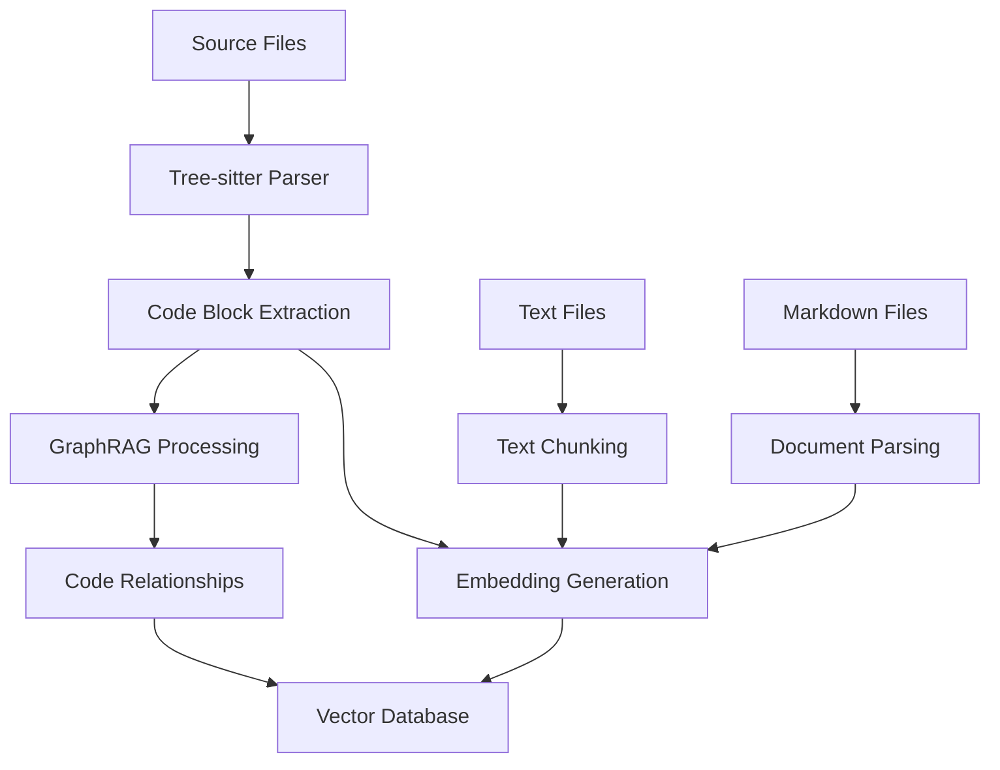

# Indexing and Search Guide

## Overview

OctoDev's indexing system processes your codebase to create a searchable knowledge base using semantic embeddings and tree-sitter parsing. This enables natural language code search and provides context for AI assistance.

## How Indexing Works

### Architecture



### Processing Pipeline

1. **File Discovery**: Scans project files respecting `.gitignore`
2. **Language Detection**: Uses file extensions to identify programming languages
3. **Parsing**: Tree-sitter extracts meaningful code regions
4. **Embedding**: Converts code/text to vector representations
5. **Storage**: Stores in SurrealDB with RocksDB backend
6. **GraphRAG**: Creates relationships between code entities

## Basic Indexing

### Initial Index

```bash
# Index current directory
octodev index

# Index specific directory
octodev index /path/to/project

# Index with progress display
octodev index --verbose
```

### Watch Mode

```bash
# Auto-reindex on file changes
octodev watch

# Watch in quiet mode
octodev watch --quiet
```

## Supported File Types

### Code Files
- **Rust**: `.rs`
- **Python**: `.py`
- **JavaScript**: `.js`
- **TypeScript**: `.ts`
- **PHP**: `.php`
- **Go**: `.go`
- **C++**: `.cpp`, `.cc`, `.cxx`
- **Bash**: `.sh`, `.bash`
- **Ruby**: `.rb`
- **JSON**: `.json`

### Text Files
- **Markdown**: `.md`
- **Text**: `.txt`
- **Logs**: `.log`
- **XML**: `.xml`
- **HTML**: `.html`
- **CSV**: `.csv`
- **YAML**: `.yml`, `.yaml`
- **TOML**: `.toml`
- **INI**: `.ini`
- **Configuration**: `.conf`, `.config`

### Exclusions

Files automatically excluded:
- Binary files
- Large files (>1MB by default)
- Directories: `target/`, `.git/`, `node_modules/`, `.octodev/`
- Common build artifacts and dependencies

## Code Block Extraction

### Meaningful Regions

The indexer extracts semantically meaningful code regions:

#### Rust
- Functions (`fn`)
- Structs and implementations
- Enums and traits
- Modules
- Constants and statics

#### Python
- Function definitions
- Class definitions
- Methods

#### JavaScript/TypeScript
- Function declarations
- Class declarations
- Method definitions
- Arrow functions
- Variable declarations

#### Other Languages
Each language has specific extractors for relevant constructs.

### Symbol Extraction

For each code block, the indexer extracts:
- **Primary symbols**: Function/class names
- **Referenced symbols**: Variables, types, imports
- **Context symbols**: Parameters, return types

## Text Processing

### Chunking Strategy

Text files are processed in chunks:
- **Chunk size**: 2000 characters (configurable)
- **Overlap**: 200 characters between chunks
- **Boundary respect**: Avoids breaking words/sentences

### Markdown Processing

Markdown files are parsed by headers:
- Each section becomes a document block
- Preserves hierarchical structure
- Maintains cross-references

## Embedding Generation

### Embedding Providers

#### FastEmbed (Default)
```toml
embedding_provider = "fastembed"

[fastembed]
code_model = "all-MiniLM-L6-v2"
text_model = "all-MiniLM-L6-v2"
```

**Pros:**
- Offline operation
- No API costs
- Fast processing

**Cons:**
- Larger binary size
- Limited model selection

#### Jina (Cloud)
```toml
embedding_provider = "jina"

[jina]
code_model = "jina-embeddings-v2-base-code"
text_model = "jina-embeddings-v3"
```

**Pros:**
- High-quality embeddings
- Specialized code models
- Regular updates

**Cons:**
- Requires API key
- Network dependency
- API costs

### Model Selection

#### FastEmbed Models
- `all-MiniLM-L6-v2`: Lightweight, fast
- `all-MiniLM-L12-v2`: Better quality
- `multilingual-e5-small`: Multilingual support
- `multilingual-e5-base`: Balanced performance
- `multilingual-e5-large`: Best quality, slower

#### Jina Models
- `jina-embeddings-v2-base-code`: Optimized for code
- `jina-embeddings-v3`: General text embeddings

## Search Capabilities

### Semantic Search

```bash
# Natural language queries
octodev search "how does authentication work"
octodev search "database connection setup"
octodev search "error handling patterns"

# Expand symbol references
octodev search --expand "user registration process"

# JSON output
octodev search --json "API endpoints"
```

### Search Types

#### Code Search
Searches within code blocks using code-optimized embeddings.

#### Text Search  
Searches within text files and documentation.

#### Document Search
Searches within structured documents (markdown sections).

#### Combined Search
Default search across all content types.

## Storage System

### Database Structure

OctoDev uses SurrealDB with RocksDB backend:

```
.octodev/storage/
├── data/           # RocksDB data files
├── logs/           # Database logs
└── temp/           # Temporary files
```

### Tables

#### code_blocks
- **path**: File path
- **content**: Code content
- **symbols**: Extracted symbols
- **embedding**: Vector embedding
- **hash**: Content hash for deduplication

#### text_blocks
- **path**: File path
- **content**: Text content
- **chunk_index**: Position in file
- **embedding**: Vector embedding

#### document_blocks
- **path**: File path
- **title**: Section title
- **content**: Section content
- **embedding**: Vector embedding

#### graphrag_nodes
- **id**: Unique identifier
- **name**: Node name
- **kind**: Node type (function, class, etc.)
- **description**: AI-generated description
- **embedding**: Vector embedding

#### graphrag_relationships
- **source**: Source node ID
- **target**: Target node ID
- **type**: Relationship type
- **description**: Relationship description

## Performance Optimization

### Indexing Performance

#### Batch Processing
- Code blocks: 10 files per batch
- Embeddings: 5 items per batch
- Database writes: Atomic transactions

#### Incremental Updates
- Content hash comparison
- Skip unchanged files
- Update only modified content

#### Memory Management
- Streaming file processing
- Lazy loading of embeddings
- Automatic cleanup

### Search Performance

#### Vector Search
- Approximate nearest neighbor (ANN)
- Configurable result limits
- Distance-based ranking

#### Caching
- Query result caching
- Embedding caching
- Database connection pooling

## Monitoring and Maintenance

### Index Status

```bash
# Check index status
octodev index --status

# Clear all indexes
octodev clear

# Reindex everything
octodev index --force
```

### Storage Usage

```bash
# Check storage size
du -h .octodev/storage/

# Database statistics
octodev index --stats
```

### Troubleshooting

#### Common Issues

1. **Slow indexing**
   - Use faster embedding models
   - Increase batch sizes
   - Check disk I/O

2. **Large storage usage**
   - Exclude unnecessary files
   - Use smaller embedding models
   - Clean old indexes

3. **Poor search results**
   - Try different embedding models
   - Expand symbol references
   - Use more specific queries

#### Debug Mode

```toml
[openrouter]
log_level = "debug"
```

Enables detailed logging for:
- File processing
- Embedding generation
- Database operations
- Search queries

### Maintenance Tasks

#### Regular Cleanup
```bash
# Remove orphaned data
octodev index --cleanup

# Compact database
octodev index --compact

# Verify integrity
octodev index --verify
```

#### Backup and Restore
```bash
# Backup index
cp -r .octodev/storage backup/

# Restore index
rm -rf .octodev/storage
cp -r backup .octodev/storage
```

## Best Practices

1. **Index regularly**: Keep index up-to-date with code changes
2. **Use watch mode**: For active development
3. **Choose appropriate models**: Balance quality vs. speed
4. **Monitor storage**: Clean up periodically
5. **Optimize queries**: Use specific terms for better results
6. **Exclude build artifacts**: Update `.gitignore` appropriately
7. **Test search quality**: Verify results match expectations