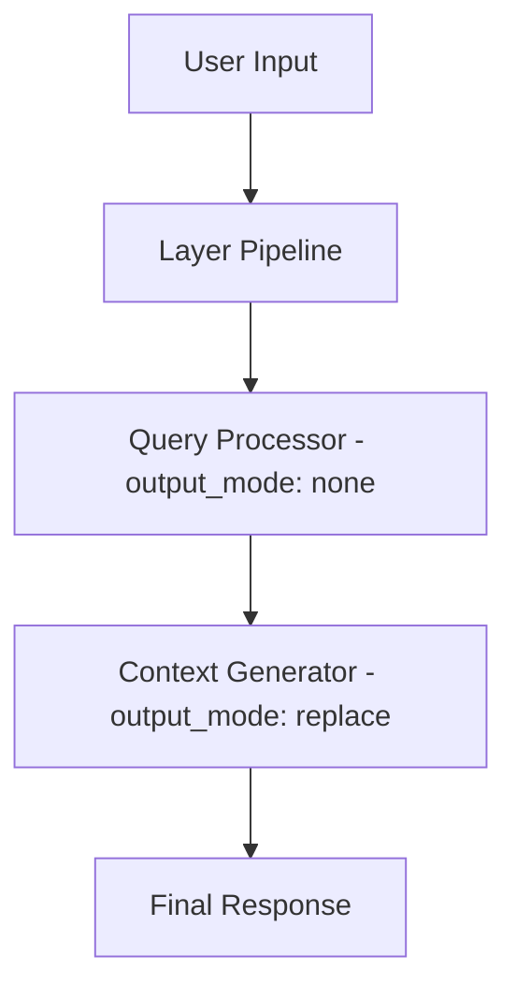

# Session Modes and Interactive Usage

## Overview

Octomind supports flexible session roles for different use cases, with two defaults provided and an extensible system for custom roles.

## Session Roles Comparison

| Feature | Developer Role | Assistant Role | Custom Roles |
|---------|----------------|----------------|---------------|
| **Purpose** | Full development assistance | Simple conversation | Specialized use cases |
| **Indexing** | Full codebase indexing | No indexing (faster startup) | Configurable |
| **Tools** | All development tools enabled | Tools disabled by default | Configurable |
| **Layers** | Supports layered architecture | Direct model interaction | Configurable |
| **Context** | Full project context | Minimal context | Configurable |
| **Resource Usage** | Higher (more features) | Lower (lightweight) | Depends on configuration |
| **Inheritance** | Inherits from global config | Base for custom roles | Inherits from assistant |

## Developer Role

Developer role is the default and provides comprehensive development assistance.

### Starting Developer Role

```bash
# Default role (developer)
octomind session

# Explicitly specify developer role
octomind session --role=developer

# Developer role with specific model
octomind session --role=developer --model="openrouter:anthropic/claude-sonnet-4"

# Named developer session
octomind session --role=developer -n development_session
```

### Developer Role Features

#### Full Tool Access
- **Shell commands**: Execute terminal commands
- **File operations**: Read, write, edit files
- **Code search**: Semantic code search
- **Project analysis**: Understanding codebase structure
- **GraphRAG**: Code relationship analysis

#### Project Context Collection
- README.md content
- Git status and branch information
- File tree structure
- Project metadata

#### Layered Architecture
Three-layer processing for complex tasks:
1. **Query Processor**: Analyzes user requests
2. **Context Generator**: Gathers relevant information
3. **Developer**: Executes development tasks

### Developer Role Configuration

```toml
[developer]
enable_layers = true
layer_refs = []
system = "You are an Octomind AI developer assistant with full access to development tools."

# MCP configuration using current server structure
[developer.mcp]
server_refs = ["developer", "filesystem", "octocode"]
allowed_tools = []  # Empty means all tools from referenced servers

# Server definitions in main MCP section
[mcp]
allowed_tools = []

[[mcp.servers]]
name = "developer"
type = "builtin"
timeout_seconds = 30
args = []
tools = []

[[mcp.servers]]
name = "filesystem"
type = "builtin"
timeout_seconds = 30
args = []
tools = []
```

## Assistant Role

Assistant role is optimized for lightweight conversations without the overhead of full development tools.

### Starting Assistant Role

```bash
# Assistant role
octomind session --role=assistant

# Assistant role with specific model
octomind session --role=assistant --model="openai:gpt-4o-mini"

# Named assistant session
octomind session --role=assistant -n quick_chat
```

### Assistant Role Features

#### Lightweight Operation
- No codebase indexing
- Faster startup time
- Lower resource usage
- Simpler system prompts

#### Optional Tool Access
```toml
[assistant.mcp]
enabled = true  # Can enable tools if needed
server_refs = ["filesystem"]  # Specific servers only
allowed_tools = ["text_editor", "list_files"]  # Limited tools
```

### Assistant Role Configuration

```toml
[assistant]
model = "openrouter:anthropic/claude-3.5-haiku"
enable_layers = false
system = "You are a helpful assistant."

[assistant.mcp]
enabled = false  # Tools disabled by default
```

## Custom Roles

Custom roles inherit from the assistant role as a base, then apply their own overrides. This provides a flexible system for creating specialized configurations.

### Creating Custom Roles

```bash
# Use a custom role
octomind session --role=code-reviewer
octomind session --role=security-analyst
octomind session --role=documentation-writer
```

### Custom Role Configuration

```toml
# Code reviewer role
[code-reviewer]
model = "openrouter:anthropic/claude-3.5-sonnet"
enable_layers = true
system = "You are a code review expert focused on security and best practices."

[code-reviewer.mcp]
enabled = true
server_refs = ["developer", "filesystem"]
allowed_tools = ["text_editor", "list_files"]

# Security analyst role
[security-analyst]
model = "openrouter:anthropic/claude-3.5-sonnet"
enable_layers = true
system = "You are a security expert focused on finding vulnerabilities and security issues."

[security-analyst.mcp]
enabled = true
server_refs = ["developer"]
allowed_tools = ["shell"]  # Limited to analysis tools

# Documentation writer role
[documentation-writer]
model = "openrouter:openai/gpt-4o"
enable_layers = false
system = "You are a technical writer focused on creating clear, comprehensive documentation."

[documentation-writer.mcp]
enabled = true
server_refs = ["filesystem"]
allowed_tools = ["text_editor", "list_files"]  # Only file operations
```

### Role Inheritance

Custom roles follow this inheritance pattern:
1. **Start with assistant role** as the base configuration
2. **Apply custom overrides** from the role-specific configuration
3. **Merge MCP settings** with server registry references

```toml
# Assistant base (inherited by all custom roles)
[assistant]
model = "openrouter:anthropic/claude-3.5-haiku"
enable_layers = false
system = "You are a helpful assistant."

[assistant.mcp]
enabled = false

# Custom role inherits from assistant, then applies overrides
[my-custom-role]
model = "openrouter:openai/gpt-4o"  # Override model
enable_layers = true                # Override layers
system = "Custom system prompt"     # Override system prompt

[my-custom-role.mcp]
enabled = true                      # Override MCP enabled
server_refs = ["filesystem"]        # Add specific servers
```

## System Variables and Placeholders

Octomind supports dynamic system variables that can be used in prompts and system messages. These variables provide real-time information about your development environment.

### Available Variables

**Individual Variables:**
- **`%{DATE}`** - Current date and time with timezone
- **`%{SHELL}`** - Current shell name and version
- **`%{OS}`** - Operating system information with architecture and platform details
- **`%{BINARIES}`** - List of available development tools and their versions (one per line)
- **`%{CWD}`** - Current working directory
- **`%{GIT_STATUS}`** - Git repository status
- **`%{GIT_TREE}`** - Git file tree
- **`%{README}`** - Project README content

**Comprehensive Variables:**
- **`%{SYSTEM}`** - Complete system information (date, shell, OS, binaries, CWD)
- **`%{CONTEXT}`** - Project context information (README, git status, git tree)

### Viewing Variables

Use the `vars` command to inspect all available variables:

```bash
# List all variables with descriptions
octomind vars

# Show actual values (expanded view)
octomind vars --expand
octomind vars -e
```

### Development Tool Detection

The `%{BINARIES}` variable automatically detects and reports versions of common development tools:

- **Build tools**: `rustc`, `gcc`, `clang`, `make`
- **Languages**: `node`, `npm`, `python`, `python3`, `go`, `java`, `php`
- **Utilities**: `awk`, `sed`, `rg`, `git`, `docker`, `curl`, `wget`, `tar`, `zip`, `unzip`

Tools are detected asynchronously for optimal performance, showing either their version or "missing" if not available.

## Markdown Themes

Octomind includes a beautiful markdown rendering system with multiple themes to enhance your experience.

### Available Themes

| Theme | Description | Best For |
|-------|-------------|----------|
| `default` | Improved default theme with gold headers and enhanced contrast | Most terminal setups |
| `dark` | Optimized for dark terminals with bright, vibrant colors | Dark terminal backgrounds |
| `light` | Perfect for light terminal backgrounds with darker colors | Light terminal backgrounds |
| `ocean` | Beautiful blue-green palette inspired by ocean themes | Users who prefer calm, aquatic colors |
| `solarized` | Based on the popular Solarized color scheme | Fans of the classic Solarized palette |
| `monokai` | Inspired by the popular Monokai syntax highlighting theme | Users familiar with Monokai from code editors |

### Configuring Themes

```bash
# Set a theme
octomind config --markdown-theme ocean

# Enable markdown rendering (if not already enabled)
octomind config --markdown-enable true

# View current theme
octomind config --show

# See all available themes (error message shows valid options)
octomind config --markdown-theme invalid
```

All themes include headers, code blocks, inline code, lists, emphasis, quotes, and links with appropriate styling.

## Session Management

### Creating and Managing Sessions

```bash
# Create new named session
octomind session -n project_review

# Resume existing session
octomind session -r project_review

# List all sessions
octomind session --list

# Session with custom model
octomind session --model="anthropic:claude-3-5-sonnet" -n analysis
```

### Session Commands

During a session, use these commands:

#### Navigation Commands
- `/help` - Show all available commands
- `/list` - List all sessions
- `/session [name]` - Switch to another session
- `/exit` or `/quit` - Exit current session

#### Configuration Commands
- `/model [model]` - Show/change current model
- `/image <path>` - Attach image to your next message (PNG, JPEG, GIF, WebP, BMP)
- `/info` - Display token usage and costs
- `/report` - Generate detailed usage report with cost breakdown per request
- `/loglevel [debug|info|none]` - Set log level

#### Context Management
- `/cache` - Mark cache checkpoint for cost optimization
- `/context [filter]` - Display session context with optional filtering: all, assistant, user, tool, large
- `/done` - Finalize task with comprehensive summarization, memorization, and auto-commit (task completion)
- `/clear` - Clear screen
- `/save` - Save session

**Context Management Strategy:**
- Use `/done` when task is complete (preserves full context with current model + auto-commit)
- `/done` acts like "git commit" for conversations - finalizes and preserves work phase

#### Context Display Command

The `/context` command displays the current session context that would be sent to the AI, with optional filtering capabilities:

```bash
# Show all messages (default)
> /context
> /context all

# Show only assistant responses
> /context assistant

# Show only user messages
> /context user

# Show only tool-related messages (tool calls, tool responses)
> /context tool

# Show only large messages (>2 standard deviations from median)
> /context large
```

**Filter Options:**
- **`all`** (default) - Display all messages in the session
- **`assistant`** - Show only AI assistant responses
- **`user`** - Show only user messages
- **`tool`** - Show messages with tool calls, tool responses, or tool-related content
- **`large`** - Show messages significantly above average size (>2 standard deviations from median)

**Features:**
- Token count and percentage for each message
- Content truncation in normal mode (use `/loglevel debug` for full content)
- Session statistics (total vs. filtered message counts)
- For `large` filter: displays median, standard deviation, and threshold information

#### Architecture Commands
- `/layers` - Toggle layered processing

## Multimodal Vision Support

Octomind supports image analysis across all AI providers through the `/image` command.

### Supported Formats

- **Image Types**: PNG, JPEG, GIF, WebP, BMP, TIFF, ICO, SVG, AVIF, HEIC, HEIF
- **Path Types**: Relative paths, absolute paths, tilde expansion (`~/images/`)
- **Intelligent Completion**: Tab completion with image file filtering

### Usage Examples

```bash
# Attach local image
> /image screenshot.png
> What's wrong with this UI layout?

# Absolute path
> /image /path/to/diagram.jpg
> Explain this architecture diagram

# Tilde expansion
> /image ~/Downloads/error_message.png
> Help me debug this error

# Relative path with directory
> /image ./assets/mockup.png
> Review this design mockup
```

### Vision-Capable Models by Provider

| Provider | Vision Models |
|----------|---------------|
| **Anthropic** | Claude 3+, Claude 3.5+, Claude 4+ |
| **OpenAI** | GPT-4o, GPT-4o-mini, GPT-4-turbo, GPT-4-vision |
| **OpenRouter** | All vision models from underlying providers |
| **Google** | Gemini 1.5+, Gemini 2.0+, Gemini 2.5+ |
| **Amazon** | Claude models on Bedrock |
| **Cloudflare** | Llama 3.2 vision models |

### Features

- **Model Detection**: Automatic vision support detection for current model
- **Terminal Preview**: Small image preview in terminal when attached
- **Path Completion**: Smart autocomplete for image files with filtering
- **Error Handling**: Clear feedback for unsupported formats or missing files

### Tips

- Copy an image to clipboard and run `/image` to auto-attach (when available)
- Use `/model` to switch to a vision-capable model if needed
- Images are attached to your next message - send text after attaching

### Session Storage

Sessions are stored in `.octomind/sessions/`:

```
.octomind/sessions/
├── default.jsonl           # Default session
├── project_review.jsonl    # Named session
└── quick_chat.jsonl        # Chat mode session
```

Each session file contains:
- Message history
- Token usage statistics
- Layer processing stats
- Cache markers
- Session metadata

## Session Reporting

### Usage Reports

The `/report` command generates comprehensive usage analysis for your current session:

```bash
> /report
```

#### Report Structure

The report provides a detailed breakdown of each request in your session:

```
┌─────────────────────────────────────┬──────────┬────────────┬───────────────┬────────────┬─────────┬─────────────────┐
│ User Request                        │ Cost ($) │ Tool Calls │ Tools Used    │ Human Time │ AI Time │ Processing Time │
├─────────────────────────────────────┼──────────┼────────────┼───────────────┼────────────┼─────────┼─────────────────┤
│ analyze this authentication code    │ 0.01234  │ 3          │ text_editor(2)│ 2m 15s     │ 1.2s    │ 68ms            │
│                                     │          │            │ search_code(1)│            │         │                 │
│ add error handling to login         │ 0.00890  │ 2          │ text_editor(2)│ 1m 45s     │ 950ms   │ 45ms            │
│ /done                               │ 0.00156  │ 0          │ -             │ 30s        │ 800ms   │ 0ms             │
├─────────────────────────────────────┼──────────┼────────────┼───────────────┼────────────┼─────────┼─────────────────┤
│ TOTAL                               │ 0.02280  │ 5          │ 5 total calls │ 4m 30s     │ 2.95s   │ 113ms           │
└─────────────────────────────────────┴──────────┴────────────┴───────────────┴────────────┴─────────┴─────────────────┘

📈 Summary: 3 requests, $0.02280 total cost, 5 tool calls, 4m 30s human time, 2.95s AI time, 113ms processing time
```

#### Column Descriptions

- **User Request**: Your input (truncated for display)
- **Cost ($)**: Actual cost spent on this specific request
- **Tool Calls**: Number of tools executed
- **Tools Used**: Detailed breakdown like `text_editor(2), shell(1)`
- **Human Time**: Real-world time between requests
- **AI Time**: API latency (network + AI processing)
- **Processing Time**: Local tool execution time

#### Time Categories

1. **Human Time**: Time you spent between sending requests
   - Calculated from log timestamps
   - Shows actual working session duration
   - Last request shows time to when report was generated

2. **AI Time**: Time waiting for AI responses
   - Pure API request/response latency
   - Network time + AI model processing
   - Sourced from provider response timing

3. **Processing Time**: Local tool execution
   - File operations, shell commands, code analysis
   - Only time spent executing tools locally
   - Excludes AI thinking time

#### Cost Tracking

- **Per-Request Costs**: Exact cost delta for each user input
- **Command Costs**: Includes `/done`, `/model` and other session commands
- **Real-Time Calculation**: Uses session stats snapshots for accuracy
- **Provider Agnostic**: Works with all supported AI providers

### Comparison with `/info`

| Command | Purpose | Scope |
|---------|---------|-------|
| `/info` | Current session totals | Overall session statistics |
| `/report` | Per-request breakdown | Detailed request-by-request analysis |

Use `/info` for quick session overview, `/report` for detailed usage analysis.

## Layered Architecture

### How Layers Work

The layered architecture processes complex requests through configurable stages. All layers use the same `GenericLayer` implementation with different configurations:



### Layer Configuration

All layers are configured through the `[[layers]]` section with consistent parameters:

#### Built-in Layer Defaults
```toml
[developer]
enable_layers = true

# Built-in layers with default configurations:
# - Query Processor: output_mode = "none" (intermediate)
# - Context Generator: output_mode = "replace" (replaces input)
```

#### Custom Layer Configuration
```toml
[developer]
model = "openrouter:anthropic/claude-sonnet-4"
enable_layers = true

# All layers are configured through [[layers]] sections

[[layers]]
name = "query_processor"
model = "openrouter:openai/gpt-4.1-mini"
temperature = 0.2
input_mode = "Last"
output_mode = "none"  # Intermediate layer
builtin = true

[[layers]]
name = "context_generator"
model = "openrouter:google/gemini-2.5-flash-preview"
temperature = 0.2
input_mode = "Last"
output_mode = "replace"  # Replaces input with context
builtin = true

[layers.mcp]
server_refs = ["developer", "filesystem"]
allowed_tools = ["search_code", "view_signatures", "list_files"]

[[layers]]
name = "reducer"
model = "openrouter:openai/o4-mini"
temperature = 0.2
input_mode = "All"
output_mode = "replace"  # Replaces session content
builtin = true
```

#### Advanced Layer Configuration

You can create custom layers with any combination of settings:

```toml
[[layers]]
name = "custom_analyzer"
model = "openrouter:anthropic/claude-3.5-sonnet"
system_prompt = "You are a specialized code analyzer..."
temperature = 0.1
input_mode = "Last"
output_mode = "append"  # Add analysis to session
builtin = false

[layers.mcp]
server_refs = ["developer", "filesystem"]
allowed_tools = ["text_editor", "list_files"]
```

### Input and Output Modes

#### Input Modes
Layers can process input in different modes:

- **Last**: Only the most recent output from previous layer
- **All**: All context from previous layers
- **Summary**: Summarized version of all previous context

#### Output Modes
Layers can affect the session in different ways:

- **none**: Intermediate layer that doesn't modify the session (like query_processor)
- **append**: Adds layer output as a new message to the session
- **replace**: Replaces the entire session content with the layer output (like reducer)

## Tool Integration (MCP)

### Available Tools

#### Core Tools
- **shell**: Execute shell commands
- **text_editor**: Edit files
- **list_files**: Browse directories
- **html2md**: Convert HTML to Markdown

#### Development Tools
- **Project analysis**: Built-in code understanding

### Tool Usage Examples

```bash
# In session, AI can use tools automatically:
> "List all Python files in the src directory"

AI uses: list_files
Parameters: {"directory": "src", "pattern": "*.py"}

> "Show me the authentication function"

AI analyzes files and finds relevant code automatically

> "Edit the config file to add a new setting"

AI uses: text_editor
Parameters: {"command": "str_replace", "path": "config.toml", ...}
```

### Tool Configuration

```toml
# Global MCP configuration
[mcp]
enabled = true
providers = ["core"]

# Mode-specific tool access
[agent.mcp]
enabled = true
providers = ["core", "filesystem", "development"]

[chat.mcp]
enabled = false  # No tools in chat mode
```

## Performance and Cost Optimization

### Model Selection by Use Case

#### For Quick Questions (Assistant Role)
```toml
[assistant]
model = "google:gemini-1.5-flash"  # Fast and cheap
```

#### For Development Work (Developer Role)
```toml
[developer]
model = "openrouter:anthropic/claude-sonnet-4"  # Best reasoning
```

#### Layer-Specific Optimization
```toml
# Cheap models for simple processing
query_processor_model = "google:gemini-1.5-flash"
context_generator_model = "openai:gpt-4o-mini"

# Expensive model only for final development work
developer_model = "openrouter:anthropic/claude-sonnet-4"
```

### Token Management

#### Automatic Management
```toml
[openrouter]
cache_tokens_pct_threshold = 40  # Auto-cache at 40%
max_request_tokens_threshold = 50000  # Auto-truncate
enable_auto_truncation = true
```

#### Manual Management
```bash
# In session:
/cache           # Mark cache point
/truncate        # Toggle auto-truncation
/info            # Check token usage
/done            # Complete task with memorization & commit
```

## Context Management Commands

Octomind provides commands for managing session context:

### `/context` - Session Context Display & Filtering

**Purpose**: Display the current session context that would be sent to the AI with optional filtering capabilities.

**Usage**:
```bash
/context [filter]
```

**Filter Options**:
- **`all`** (default) - Display all messages in the session
- **`assistant`** - Show only AI assistant responses
- **`user`** - Show only user messages
- **`tool`** - Show messages with tool calls, tool responses, or tool-related content
- **`large`** - Show messages significantly above average size (>2 standard deviations from median)

**Features**:
- Token count and percentage for each message
- Content truncation in normal mode (use `/loglevel debug` for full content)
- Session statistics (total vs. filtered message counts)
- For `large` filter: displays median, standard deviation, and threshold information

**When to use**:
- ✅ Debug context issues or understand what's being sent to AI
- ✅ Analyze conversation patterns or find specific message types
- ✅ Identify large messages that may be consuming excessive tokens
- ✅ Review tool usage and AI responses

### `/done` - Task Completion & Finalization

**Purpose**: Complete and finalize a development task with full preservation of context for future work.

**What it does**:
- **Memorizes** important information for future reference using the `memorize` tool
- **Summarizes** the entire conversation preserving all technical details, decisions, and context
- **Auto-commits** changes using octocode (if available) - similar to `git add` for task finalization
- **Preserves** all files modified, commands used, and task completion status
- **Resets** layer processing for the next task while maintaining full context
- Uses the **current model** (not a cheaper reducer layer)

**When to use**:
- ✅ Task is complete or at a major milestone
- ✅ You want to preserve all work and context for future sessions
- ✅ Ready to commit changes and document progress
- ✅ Want to continue working on related tasks with full context

**Example workflow**:
```bash
> "Add authentication to the login system"
[AI implements authentication, modifies files]
> "Add error handling and validation"
[AI adds error handling, updates multiple files]
> /done
# Memorizes all changes, summarizes implementation, commits files
# Next message will go through layers again with preserved context
```

## Best Practices

### Choose the Right Mode

#### Use Developer Role When:
- Working on code development
- Need access to project files
- Require code analysis
- Want AI to execute commands
- Need full project context

#### Use Assistant Role When:
- Quick questions
- General conversations
- No need for project context
- Want faster responses
- Simple text processing

#### Use Custom Roles When:
- Need specialized behavior
- Want limited tool access
- Have specific use cases
- Need role-specific prompts

### Session Organization

```bash
# Organize sessions by purpose
octomind session -n bug_fixing --role=developer
octomind session -n code_review --role=code-reviewer
octomind session -n quick_help --role=assistant
octomind session -n security_audit --role=security-analyst
```

### Cost Control

1. **Use appropriate models**: Expensive for complex, cheap for simple
2. **Enable caching**: Reduce repeated context costs
3. **Monitor usage**: Check `/info` regularly
4. **Optimize layers**: Use cheap models for processing layers
5. **Truncate context**: Use `/done` for task completion

### Session Hygiene

1. **Save regularly**: Use `/save` for important sessions
2. **Clean up**: Remove old sessions periodically
3. **Use descriptive names**: Make sessions easy to identify
4. **Resume efficiently**: Use `-r` to continue work
