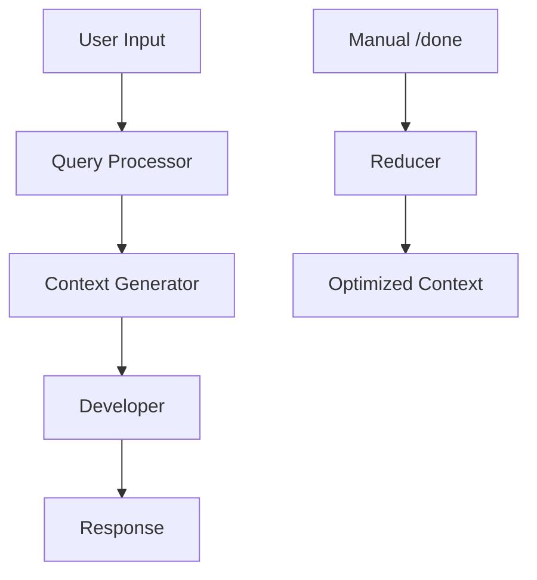

# Session Modes and Interactive Usage

## Overview

OctoDev provides two distinct session modes designed for different use cases: **Agent Mode** for full development assistance and **Chat Mode** for simple conversations. Each mode has different capabilities, tool access, and optimization strategies.

## Session Modes Comparison

| Feature | Agent Mode | Chat Mode |
|---------|------------|-----------|
| **Purpose** | Full development assistance | Simple conversation |
| **Indexing** | Full codebase indexing | No indexing (faster startup) |
| **Tools** | All development tools enabled | Tools disabled by default |
| **Layers** | Supports layered architecture | Direct model interaction |
| **Context** | Full project context | Minimal context |
| **Resource Usage** | Higher (more features) | Lower (lightweight) |

## Agent Mode

Agent mode is the default and provides comprehensive development assistance.

### Starting Agent Mode

```bash
# Default mode (agent)
octodev session

# Explicitly specify agent mode
octodev session --mode=agent

# Agent mode with specific model
octodev session --mode=agent --model="openrouter:anthropic/claude-sonnet-4"

# Named agent session
octodev session --mode=agent -n development_session
```

### Agent Mode Features

#### Full Tool Access
- **Shell commands**: Execute terminal commands
- **File operations**: Read, write, edit files
- **Code search**: Semantic code search
- **Project analysis**: Understanding codebase structure
- **GraphRAG**: Code relationship analysis

#### Project Context Collection
- README.md content
- Git status and branch information
- File tree structure
- Project metadata

#### Layered Architecture
Three-layer processing for complex tasks:
1. **Query Processor**: Analyzes user requests
2. **Context Generator**: Gathers relevant information
3. **Developer**: Executes development tasks

### Agent Mode Configuration

```toml
[agent]
system = "You are an Octodev AI developer assistant with full access to development tools."

[agent.openrouter]
model = "openrouter:anthropic/claude-sonnet-4"
enable_layers = true

[agent.mcp]
enabled = true
providers = ["core", "filesystem"]

[[agent.servers]]
enabled = true
name = "DevTools"
command = "python"
args = ["-m", "dev_server"]
```

## Chat Mode

Chat mode is optimized for lightweight conversations without the overhead of full development tools.

### Starting Chat Mode

```bash
# Chat mode
octodev session --mode=chat

# Chat mode with specific model
octodev session --mode=chat --model="openai:gpt-4o-mini"

# Named chat session
octodev session --mode=chat -n quick_chat
```

### Chat Mode Features

#### Lightweight Operation
- No codebase indexing
- Faster startup time
- Lower resource usage
- Simpler system prompts

#### Optional Tool Access
```toml
[chat.mcp]
enabled = true  # Can enable tools if needed
providers = ["web-search"]  # Specific tools only
```

### Chat Mode Configuration

```toml
[chat]
system = "You are a helpful assistant."

[chat.openrouter]
model = "openrouter:anthropic/claude-3.5-haiku"
enable_layers = false

[chat.mcp]
enabled = false  # Tools disabled by default
```

## Session Management

### Creating and Managing Sessions

```bash
# Create new named session
octodev session -n project_review

# Resume existing session
octodev session -r project_review

# List all sessions
octodev session --list

# Session with custom model
octodev session --model="anthropic:claude-3-5-sonnet" -n analysis
```

### Session Commands

During a session, use these commands:

#### Navigation Commands
- `/help` - Show all available commands
- `/list` - List all sessions
- `/session [name]` - Switch to another session
- `/exit` or `/quit` - Exit current session

#### Configuration Commands
- `/model [model]` - Show/change current model
- `/info` - Display token usage and costs
- `/debug` - Toggle debug mode

#### Context Management
- `/cache` - Mark cache checkpoint
- `/truncate [threshold]` - Toggle auto-truncation
- `/done` - Optimize context and restart layers
- `/clear` - Clear screen
- `/save` - Save session

#### Architecture Commands
- `/layers` - Toggle layered processing

### Session Storage

Sessions are stored in `.octodev/sessions/`:

```
.octodev/sessions/
├── default.jsonl           # Default session
├── project_review.jsonl    # Named session
└── quick_chat.jsonl        # Chat mode session
```

Each session file contains:
- Message history
- Token usage statistics
- Layer processing stats
- Cache markers
- Session metadata

## Layered Architecture

### How Layers Work

The layered architecture processes complex requests through specialized stages:



### Layer Configuration

#### Default Layers
```toml
[openrouter]
enable_layers = true

# Uses default models for each layer:
# - Query Processor: openrouter:openai/gpt-4.1-nano
# - Context Generator: openrouter:google/gemini-2.5-flash-preview  
# - Developer: main model from config
```

#### Custom Layer Models
```toml
[openrouter]
model = "openrouter:anthropic/claude-sonnet-4"
enable_layers = true

# Override models for specific layers
query_processor_model = "openrouter:openai/gpt-4.1-nano"
context_generator_model = "openrouter:google/gemini-1.5-flash"
developer_model = "openrouter:anthropic/claude-sonnet-4"
reducer_model = "openrouter:openai/gpt-4o-mini"
```

#### Advanced Layer Configuration
```toml
[[layers]]
name = "query_processor"
enabled = true
model = "openrouter:openai/gpt-4.1-nano"
temperature = 0.1
enable_tools = false
input_mode = "Last"
system_prompt = "You analyze and improve user queries."

[[layers]]
name = "context_generator"
enabled = true
model = "openrouter:google/gemini-1.5-flash"
temperature = 0.2
enable_tools = true
allowed_tools = ["core", "text_editor"]
input_mode = "Last"

[[layers]]
name = "developer"
enabled = true
model = "openrouter:anthropic/claude-sonnet-4"
temperature = 0.3
enable_tools = true
input_mode = "All"
```

### Input Modes

Layers can process input in different modes:

- **Last**: Only the most recent output from previous layer
- **All**: All context from previous layers
- **Summary**: Summarized version of all previous context

## Tool Integration (MCP)

### Available Tools

#### Core Tools
- **shell**: Execute shell commands
- **text_editor**: Edit files
- **list_files**: Browse directories
- **semantic_code**: Search and analyze code

#### Development Tools
- **code_search**: Semantic code search
- **docs_search**: Documentation search
- **text_search**: Text content search
- **graphrag**: Code relationship analysis

### Tool Usage Examples

```bash
# In session, AI can use tools automatically:
> "List all Python files in the src directory"

AI uses: list_files
Parameters: {"directory": "src", "pattern": "*.py"}

> "Show me the authentication function"

AI uses: semantic_code
Parameters: {"mode": "search", "query": "authentication function"}

> "Edit the config file to add a new setting"

AI uses: text_editor
Parameters: {"command": "str_replace", "path": "config.toml", ...}
```

### Tool Configuration

```toml
# Global MCP configuration
[mcp]
enabled = true
providers = ["core"]

# Mode-specific tool access
[agent.mcp]
enabled = true
providers = ["core", "filesystem", "development"]

[chat.mcp]
enabled = false  # No tools in chat mode
```

## Performance and Cost Optimization

### Model Selection by Use Case

#### For Quick Questions (Chat Mode)
```toml
[chat.openrouter]
model = "google:gemini-1.5-flash"  # Fast and cheap
```

#### For Development Work (Agent Mode)
```toml
[agent.openrouter]
model = "openrouter:anthropic/claude-sonnet-4"  # Best reasoning
```

#### Layer-Specific Optimization
```toml
# Cheap models for simple processing
query_processor_model = "google:gemini-1.5-flash"
context_generator_model = "openai:gpt-4o-mini"

# Expensive model only for final development work
developer_model = "openrouter:anthropic/claude-sonnet-4"
```

### Token Management

#### Automatic Management
```toml
[openrouter]
cache_tokens_pct_threshold = 40  # Auto-cache at 40%
max_request_tokens_threshold = 50000  # Auto-truncate
enable_auto_truncation = true
```

#### Manual Management
```bash
# In session:
/cache           # Mark cache point
/truncate        # Toggle auto-truncation
/info            # Check token usage
/done            # Optimize context
```

## Best Practices

### Choose the Right Mode

#### Use Agent Mode When:
- Working on code development
- Need access to project files
- Require code analysis
- Want AI to execute commands

#### Use Chat Mode When:
- Quick questions
- General conversations
- No need for project context
- Want faster responses

### Session Organization

```bash
# Organize sessions by purpose
octodev session -n bug_fixing --mode=agent
octodev session -n code_review --mode=agent  
octodev session -n quick_help --mode=chat
```

### Cost Control

1. **Use appropriate models**: Expensive for complex, cheap for simple
2. **Enable caching**: Reduce repeated context costs
3. **Monitor usage**: Check `/info` regularly
4. **Optimize layers**: Use cheap models for processing layers
5. **Truncate context**: Use `/done` to optimize

### Session Hygiene

1. **Save regularly**: Use `/save` for important sessions
2. **Clean up**: Remove old sessions periodically
3. **Use descriptive names**: Make sessions easy to identify
4. **Resume efficiently**: Use `-r` to continue work