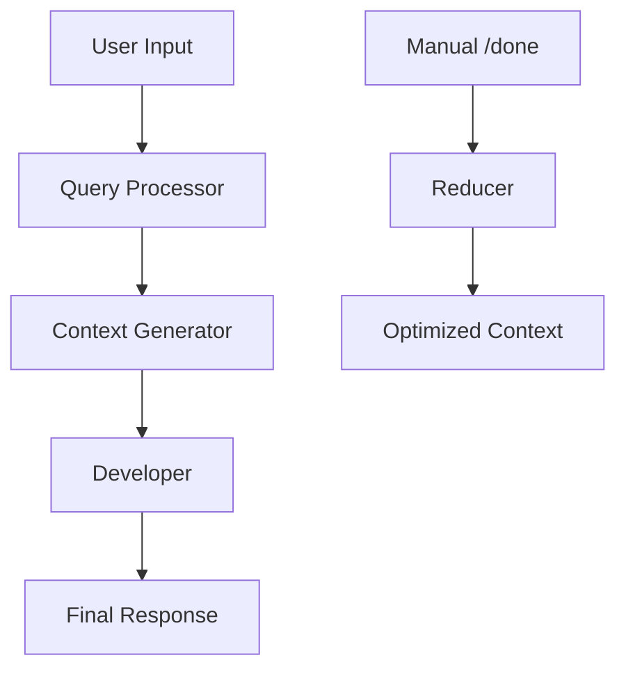

# Advanced Features Guide

## Overview

Octomind's advanced features enable sophisticated development workflows through MCP tool integration, layered AI architecture, and extensible configuration. This guide covers capabilities beyond basic session usage.

## MCP (Model-Centric Programming) Protocol

### What is MCP?

MCP enables AI models to use external tools and services through a standardized protocol. Octomind provides development capabilities through natural conversation by integrating tools seamlessly into AI interactions.

### Built-in MCP Tools

#### Developer Tools (server_type: "developer")
- **shell**: Execute terminal commands and development scripts
- **Code analysis**: Built-in code understanding and project analysis

#### Filesystem Tools (server_type: "filesystem")
- **text_editor**: Read, write, edit files with multiple operations (view, create, str_replace, insert, line_replace, undo_edit, view_many, batch_edit)
- **list_files**: Browse directory structures with pattern matching and content search
- **html2md**: Convert HTML content to Markdown format

### Text Editor Tool Reference

The `text_editor` tool provides comprehensive file manipulation capabilities through multiple commands:

#### Individual Operations

**view** - Examine file contents or directory listings
```json
{"command": "view", "path": "src/main.rs"}
{"command": "view", "path": "src/main.rs", "view_range": [10, 20]}
{"command": "view", "path": "src/"}
```

**create** - Create new files with content
```json
{"command": "create", "path": "src/new_module.rs", "file_text": "pub fn hello() {\n    println!(\"Hello!\");\n}"}
```

**str_replace** - Replace specific strings in files
```json
{"command": "str_replace", "path": "src/main.rs", "old_str": "fn old_name()", "new_str": "fn new_name()"}
```

**insert** - Insert text at specific line positions
```json
{"command": "insert", "path": "src/main.rs", "insert_line": 5, "new_str": "// New comment\nlet x = 10;"}
```

**line_replace** - Replace content within specific line ranges
```json
{"command": "line_replace", "path": "src/main.rs", "view_range": [5, 8], "new_str": "fn updated_function() {\n    // New implementation\n}"}
```

**undo_edit** - Revert the most recent edit
```json
{"command": "undo_edit", "path": "src/main.rs"}
```

**view_many** - View multiple files simultaneously
```json
{"command": "view_many", "paths": ["src/main.rs", "src/lib.rs", "tests/test.rs"]}
```

#### Batch Operations

**batch_edit** - Perform multiple editing operations in a single call
```json
{
  "command": "batch_edit",
  "operations": [
    {
      "operation": "str_replace",
      "path": "src/main.rs",
      "old_str": "old_function_name",
      "new_str": "new_function_name"
    },
    {
      "operation": "insert",
      "path": "src/lib.rs",
      "insert_line": 5,
      "new_str": "// New comment\nuse new_module;"
    },
    {
      "operation": "line_replace",
      "path": "src/config.rs",
      "view_range": [10, 15],
      "new_str": "// Updated configuration\nconst NEW_CONFIG: &str = \"value\";"
    }
  ]
}
```

**Batch Edit Features:**
- **Maximum 50 operations** per batch for performance
- **Supported operations**: str_replace, insert, line_replace
- **Cross-file editing**: Make changes across multiple files simultaneously
- **Detailed reporting**: Success/failure status for each operation
- **Error isolation**: Failed operations don't affect successful ones
- **File history preservation**: Each operation saves file history for undo

**When to Use Batch Edit:**
- ✅ **Multiple file refactoring** - Rename functions across files
- ✅ **Consistent changes** - Apply same pattern to multiple files
- ✅ **Independent modifications** - Changes that don't depend on each other
- ✅ **Bulk updates** - Update imports, comments, or configuration
- ❌ **Sequential dependencies** - When changes depend on previous results
- ❌ **Complex logic** - When you need conditional modifications

### MCP Server Configuration

The MCP system uses a centralized server configuration in the main `[mcp]` section:

```toml
# MCP Server Configuration - Define servers once, reference everywhere
[mcp]
allowed_tools = []

# Built-in server definitions
[[mcp.servers]]
name = "developer"
server_type = "developer"
mode = "http"
timeout_seconds = 30
args = []
tools = []  # Empty means all tools enabled
builtin = true

[[mcp.servers]]
name = "filesystem"
server_type = "filesystem"
mode = "http"
timeout_seconds = 30
args = []
tools = []  # Empty means all tools enabled
builtin = true

# External HTTP server example
[[mcp.servers]]
name = "web_search"
server_type = "external"
url = "https://mcp.so/server/webSearch-Tools"
auth_token = "optional_token"
mode = "http"
timeout_seconds = 30
tools = []
builtin = false

# External command-based server example
[[mcp.servers]]
name = "local_tools"
server_type = "external"
command = "python"
args = ["-m", "my_mcp_server", "--port", "8008"]
mode = "stdin"
timeout_seconds = 30
tools = ["custom_tool1", "custom_tool2"]  # Only these tools enabled
builtin = false
```

### Role-Based Server Access

Roles reference servers from the main MCP configuration and can limit tool access:

```toml
# Developer role with full access
[developer.mcp]
server_refs = ["developer", "filesystem"]
allowed_tools = []  # Empty means all tools from referenced servers

# Assistant role with limited access
[assistant.mcp]
server_refs = ["filesystem"]
allowed_tools = ["text_editor", "list_files"]  # Only specific tools

# Custom role with external tools
[code-reviewer.mcp]
server_refs = ["developer", "web_search"]
allowed_tools = ["text_editor", "shell"]
```

### Server Types

- **developer**: Built-in development tools (shell commands, code analysis)
- **filesystem**: Built-in file operations (reading, writing, editing files)
- **external**: External MCP servers (HTTP or command-based)

### External MCP Servers

#### HTTP-based Servers
```toml
[[mcp.servers]]
name = "web_tools"
server_type = "external"
url = "https://api.example.com/mcp"
auth_token = "your_token"
mode = "http"
timeout_seconds = 30
tools = []
builtin = false
```

#### Command-based Servers
```toml
[[mcp.servers]]
name = "custom_tools"
server_type = "external"
command = "python"
args = ["/path/to/mcp_server.py"]
mode = "stdin"
timeout_seconds = 30
```

## Layered Architecture

### Overview

For complex development tasks, Octomind uses a multi-stage AI processing system that breaks down work into specialized layers:



### Layer Responsibilities

#### Query Processor
- **Purpose**: Analyze and improve user requests
- **Tools**: None (pure analysis)
- **Model**: Fast, efficient model for text processing
- **Output**: Clarified, actionable instructions

#### Context Generator
- **Purpose**: Gather necessary information using tools
- **Tools**: Limited set (file reading, code search)
- **Model**: Balanced model with tool capabilities
- **Output**: Relevant code, documentation, and context

#### Developer
- **Purpose**: Execute development tasks and provide solutions
- **Tools**: Full access to all available tools
- **Model**: Most capable model for complex reasoning
- **Output**: Complete response with code changes and explanations

#### Reducer (Manual)
- **Purpose**: Optimize context for future interactions
- **Trigger**: Manual via `/done` command
- **Tools**: None (pure optimization)
- **Output**: Optimized conversation context

### Layered Architecture Configuration

```toml
[developer]
model = "openrouter:anthropic/claude-sonnet-4"
enable_layers = true

# Optional: Specify models for each layer
query_processor_model = "openrouter:openai/gpt-4o-mini"
context_generator_model = "openrouter:google/gemini-1.5-flash"
developer_model = "openrouter:anthropic/claude-sonnet-4"
reducer_model = "openrouter:openai/gpt-4o-mini"
```

### Session Commands for Layers

- `/layers` - Toggle layered processing on/off
- `/done` - Manually trigger context optimization
- `/info` - View token usage by layer

## Token Management

### Automatic Token Management

```toml
[developer]
# Warn when tool outputs exceed threshold
mcp_response_warning_threshold = 20000

# Auto-truncate context when limit reached
max_request_tokens_threshold = 50000
enable_auto_truncation = false

# Cache management
cache_tokens_pct_threshold = 40
```

### Session Token Commands

- `/cache` - Mark cache checkpoint for cost savings
- `/truncate [threshold]` - Toggle auto-truncation
- `/info` - Display token usage and cost breakdown

## Advanced Configuration Patterns

### Multi-Provider Setup
```toml
# Use different providers for different purposes
[developer]
model = "openrouter:anthropic/claude-sonnet-4"  # Main development
query_processor_model = "openai:gpt-4o-mini"   # Fast processing
context_generator_model = "google:gemini-1.5-flash"  # Good balance

[assistant]
model = "openrouter:anthropic/claude-3.5-haiku"  # Lightweight chat
```

### Role-Specific Tool Access
```toml
# Security-focused role
[security-reviewer]
model = "openrouter:anthropic/claude-3.5-sonnet"
enable_layers = true

[security-reviewer.mcp]
enabled = true
server_refs = ["developer", "filesystem"]
allowed_tools = ["text_editor", "shell"]  # Limited tools for security focus

# Documentation role
[docs-writer]
model = "openrouter:openai/gpt-4o"
enable_layers = false

[docs-writer.mcp]
enabled = true
server_refs = ["filesystem"]
allowed_tools = ["text_editor", "html2md"]  # Only doc-related tools
```

### External Tool Integration
```toml
# Web development setup
[web-dev]
model = "openrouter:anthropic/claude-sonnet-4"

[web-dev.mcp]
enabled = true
server_refs = ["developer", "filesystem", "web_tools"]

# Add web-specific MCP server
[[mcp.servers]]
name = "web_tools"
server_type = "external"
url = "https://mcp.so/server/web-dev-tools"
mode = "http"
timeout_seconds = 30
tools = []
builtin = false
```

## Session Management

### Session Persistence
- **Save sessions**: All conversations are automatically saved
- **Resume sessions**: Continue where you left off
- **Session switching**: Work on multiple projects simultaneously

### Session Commands
```bash
# In any session
/help              # Show all available commands
/list              # List all sessions
/session [name]    # Switch to another session
/save              # Manually save current session
/model [model]     # Change AI model
/clear             # Clear screen
/exit              # Exit session
```

### Session Organization
```bash
# Start named sessions for different purposes
octomind session --name "feature-auth"
octomind session --name "bugfix-login"
octomind session --name "refactor-api"

# Resume specific sessions
octomind session --resume "feature-auth"
```

## Development Workflow Integration

### Project Context Collection
Sessions automatically analyze:
- **Project structure** and organization
- **Configuration files** and build systems
- **Documentation** and README files
- **Git repository** information

### Natural Development Tasks
Instead of complex commands, simply ask:
- **"How does authentication work?"** - AI analyzes auth code
- **"Add logging to the login function"** - AI implements logging
- **"Why is the build failing?"** - AI checks build errors
- **"Refactor this function"** - AI improves code structure

### Code Analysis Capabilities
Through natural conversation:
- **File exploration**: "Show me the main configuration files"
- **Code understanding**: "Explain how this module works"
- **Pattern finding**: "Find all error handling patterns"
- **Dependency analysis**: "What files import this module?"

## Performance Optimization

### Model Selection Strategy
1. **Fast models** for simple analysis (Query Processor)
2. **Balanced models** for information gathering (Context Generator)
3. **Powerful models** for complex development tasks (Developer)

### Tool Usage Optimization
- **Batch operations**: Use `view_many` for reading multiple files, `batch_edit` for modifying multiple files
- **Specific patterns**: Use `list_files` with patterns to filter results
- **Smart caching**: Use `/cache` before large context operations

### Context Management
- **Auto-truncation**: Enable for long sessions
- **Manual optimization**: Use `/done` to optimize context
- **Token monitoring**: Use `/info` to track usage

## Troubleshooting

### Common Issues

#### MCP Configuration Problems
```bash
# Validate configuration
octomind config --validate

# Check MCP server connectivity
# (Server status is checked automatically when tools are used)
```

#### Tool Access Issues
- **Check role configuration**: Ensure server_refs include needed servers
- **Verify tool permissions**: Check allowed_tools list
- **External server issues**: Verify URL and authentication

#### Layer Performance Issues
```bash
# Monitor layer performance
/info

# Disable layers temporarily
/layers

# Optimize context
/done
```

#### Token Limit Issues
```bash
# Enable auto-truncation
/truncate 30000

# Mark cache checkpoint
/cache

# Optimize context manually
/done
```

### Debug Mode
```bash
# Enable debug logging in session
/debug

# Or in configuration
[developer]
log_level = "debug"
```

## Best Practices

### MCP Usage
1. **Start with built-in servers** before adding external ones
2. **Limit tool access** in specialized roles for security
3. **Test external servers** thoroughly before deployment
4. **Monitor tool performance** through session feedback

### Layered Architecture
1. **Enable for complex tasks** that benefit from specialized processing
2. **Use appropriate models** for each layer's complexity
3. **Monitor token usage** across layers with `/info`
4. **Optimize context** regularly with `/done`

### Session Management
1. **Use descriptive names** for sessions
2. **Save important sessions** manually when needed
3. **Switch sessions** for different projects or tasks
4. **Monitor token usage** to control costs

### Development Workflow
1. **Ask natural questions** instead of trying to construct complex commands
2. **Be specific** about what you want to accomplish
3. **Use session commands** to manage context and performance
4. **Leverage auto-analysis** by letting sessions examine your project structure

## Migration from Legacy Configuration

### MCP Migration
**Old format:**
```toml
[mcp]
enabled = true
providers = ["core"]
```

**Current format:**
```toml
[[mcp.servers]]
name = "developer"
server_type = "developer"
mode = "http"
timeout_seconds = 30
args = []
tools = []
builtin = true

[developer.mcp]
server_refs = ["developer"]
allowed_tools = []
```

### Provider Migration
**Old format:**
```toml
model = "anthropic/claude-3.5-sonnet"
```

**New format:**
```toml
model = "openrouter:anthropic/claude-3.5-sonnet"
```

Octomind automatically migrates legacy configurations, but manual updates provide better control and understanding of the new simplified structure.
