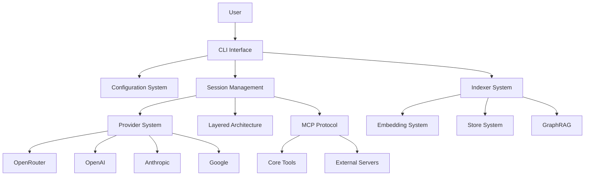

# Octodev Manual

Welcome to the comprehensive Octodev documentation. This manual provides detailed guidance on all aspects of Octodev, from basic setup to advanced features.

## Table of Contents

### 📖 Getting Started
- **[01-overview.md](./01-overview.md)** - Introduction and core concepts
- **[02-configuration.md](./02-configuration.md)** - Configuration system and settings
- **[03-providers.md](./03-providers.md)** - AI provider setup and management

### 🔧 Core Features  
- **[04-indexing.md](./04-indexing.md)** - Indexing and search capabilities
- **[05-sessions.md](./05-sessions.md)** - Interactive sessions and modes

### 🚀 Advanced Features
- **[06-advanced.md](./06-advanced.md)** - GraphRAG, MCP, and layered architecture

## Quick Reference

### Installation
```bash
git clone https://github.com/muvon/octodev.git
cd octodev
cargo build --release
```

### Basic Commands
```bash
# Index your codebase
octodev index

# Search your code
octodev search "authentication logic"

# Start interactive session
octodev session

# Configure Octodev
octodev config
```

### Key Concepts

#### **Semantic Search**
Natural language code search using vector embeddings and tree-sitter parsing.

#### **AI Sessions**
Interactive sessions with AI assistance in two modes:
- **Agent Mode**: Full development tools and project context
- **Chat Mode**: Lightweight conversations

#### **Layered Architecture**
Multi-stage AI processing:
- Query Processor → Context Generator → Developer → (Optional Reducer)

#### **GraphRAG**
Graph-based code relationship analysis for deep codebase understanding.

#### **MCP Protocol**
Tool integration system enabling AI access to external tools and services.

### Configuration Hierarchy

```
Environment Variables
    ↓
Mode-specific config [agent] / [chat]
    ↓
Global config [openrouter] / [mcp]
    ↓
Default values
```

### Supported Providers

| Provider | Format | Features |
|----------|--------|----------|
| OpenRouter | `openrouter:provider/model` | Multi-provider access, caching |
| OpenAI | `openai:model-name` | Direct API, cost calculation |
| Anthropic | `anthropic:model-name` | Claude models, caching |
| Google | `google:model-name` | Vertex AI, requires OAuth2 |

### File Structure

```
.octodev/
├── config.toml          # Configuration file
├── storage/             # Vector database
├── sessions/            # Session history
└── logs/               # Debug logs
```

## Getting Help

### Documentation Navigation
- Start with **[Overview](./01-overview.md)** for basic concepts
- Follow **[Configuration](./02-configuration.md)** for setup
- Check **[Providers](./03-providers.md)** for AI model setup
- Read **[Indexing](./04-indexing.md)** to understand search
- Explore **[Sessions](./05-sessions.md)** for interactive use
- Dive into **[Advanced](./06-advanced.md)** for complex features

### Command Line Help
```bash
# General help
octodev --help

# Command-specific help
octodev session --help
octodev config --help

# In-session help
> /help
```

### Debug Mode
```toml
[openrouter]
log_level = "debug"
```

### Common Issues
1. **API Key Missing**: Set environment variables for your AI provider
2. **Invalid Model Format**: Use `provider:model` format (e.g., `openrouter:anthropic/claude-sonnet-4`)
3. **Configuration Errors**: Run `octodev config --validate`
4. **Slow Performance**: Choose faster embedding models or enable caching

## Architecture Overview



## Recent Changes and Migration

### Provider Format Migration
**Old format (deprecated)**:
```toml
model = "anthropic/claude-3.5-sonnet"
```

**New format (required)**:
```toml
model = "openrouter:anthropic/claude-3.5-sonnet"
# or
model = "anthropic:claude-3-5-sonnet"
```

### Configuration Validation
All configurations are now validated on load. Use `octodev config --validate` to check your setup.

### Security Improvements
- API keys should be in environment variables
- Configuration files should not contain sensitive data
- File permissions should be restrictive (600)

## Contributing

Octodev is an open-source project. Contributions are welcome!

### Adding New Providers
The provider system is extensible. See `src/session/providers/` for examples.

### Adding New Tools
MCP tools can be added locally or as external servers. See the MCP documentation in the Advanced guide.

### Documentation Updates
This manual is generated from the codebase analysis. Updates should be made to both code and documentation.

---

**Version**: Latest  
**Last Updated**: January 2025  
**Project**: [Octodev](https://github.com/muvon/octodev)