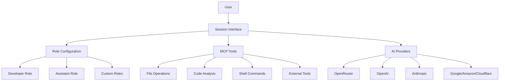

# Octomind Manual

Welcome to the comprehensive Octomind documentation. This manual provides detailed guidance on all aspects of Octomind's simplified, session-first architecture.

> **📝 Note**: The main README has been streamlined to focus on core principles and quick start. All detailed installation methods, configuration examples, and advanced features have been moved to this documentation for better organization.

## Table of Contents

### 📖 Getting Started
- **[01-installation.md](./01-installation.md)** - Installation methods, cross-compilation, shell completions
- **[02-overview.md](./02-overview.md)** - Introduction and core concepts
- **[03-configuration.md](./03-configuration.md)** - Configuration system and settings
- **[04-providers.md](./04-providers.md)** - AI provider setup and management

### 🔧 Core Features
- **[05-sessions.md](./05-sessions.md)** - Interactive sessions and modes
- **[07-command-layers.md](./07-command-layers.md)** - Specialized AI helpers and command processing

### 🚀 Advanced Features
- **[06-advanced.md](./06-advanced.md)** - MCP tools, layered architecture, and extensibility
- **[08-mcp-server-development.md](./08-mcp-server-development.md)** - Guide for adding new built-in MCP servers

## Recent Updates

### Multimodal Vision Support (Latest)
- **`/image` Command**: Attach images to your messages with intelligent file completion
- **Universal Provider Support**: Vision support across all 6 providers (Anthropic, OpenAI, OpenRouter, Google, Amazon, Cloudflare)
- **Smart Format Detection**: Automatic support for PNG, JPEG, GIF, WebP, BMP, TIFF, ICO, SVG, AVIF, HEIC, HEIF
- **Path Completion**: Enhanced autocomplete for image files including relative paths, absolute paths, and tilde expansion
- **Terminal Preview**: Small image previews in terminal for attached images
- **Model Compatibility**: Automatic vision support detection for current model

### Session Usage Reporting
- **`/report` Command**: Comprehensive usage analysis with cost breakdown per request
- **Time Separation**: Distinct tracking of Human Time, AI Time, and Processing Time
- **Cost Accuracy**: Real-time cost tracking using session stats snapshots
- **Tool Breakdown**: Detailed tool usage analysis (e.g., `text_editor(3), shell(1)`)
- **Professional Output**: Clean table format with comprehensive timing analysis

### Enhanced Tool Execution
- **Smart Tool Routing**: Tools are now automatically routed to the correct server type
- **Error Prevention**: No more "Unknown tool" errors from server mismatches
- **Robust Error Handling**: Clear diagnostic messages when tool execution fails
- **Server Registry Integration**: Centralized server configuration eliminates duplication

### Improved Command Layers
- **Case-Insensitive Input Modes**: `"Last"`, `"last"`, `"LAST"` all work identically
- **Smart Context Processing**: `input_mode = "last"` now correctly extracts last assistant response
- **Proper Session Context**: Commands receive appropriate session history based on input mode
- **Enhanced Configuration**: Simplified MCP configuration using server references

### MCP Server Configuration
Current centralized server configuration approach:

```toml
# Define servers in main MCP section
[mcp]
allowed_tools = []

[[mcp.servers]]
name = "developer"
type = "builtin"
timeout_seconds = 30
args = []
tools = []

# Reference from roles
[developer.mcp]
server_refs = ["developer", "filesystem"]
allowed_tools = []
```

## Quick Reference

### Installation
```bash
# Quick install with script
curl -fsSL https://raw.githubusercontent.com/muvon/octomind/main/install.sh | bash
```
See [Installation Guide](./01-installation.md) for detailed methods including cross-compilation and shell completions.

### Basic Commands
```bash
# Configure Octomind
octomind config

# Start development session (includes all tools)
octomind session

# Start simple chat session (no tools)
octomind session --role=assistant

# Resume a session
octomind session --resume my_session
```

### Key Concepts

#### **Session-First Architecture**
Everything happens within interactive AI sessions. No separate indexing or search commands.

#### **Role-Based Configuration**
- **Developer Role**: Full development tools and project context
- **Assistant Role**: Simple conversations without tools
- **Custom Roles**: User-defined specialized configurations

#### **MCP Tool Integration**
Built-in development tools accessible through natural conversation:
- File operations and code editing
- Shell command execution
- Code analysis and understanding

#### **Layered Architecture**
Multi-stage AI processing for complex tasks:
- Query Processor → Context Generator → Developer → (Optional Reducer)

### Configuration Hierarchy

```
Environment Variables
    ↓
Role-specific config [developer] / [assistant] / [custom-role]
    ↓
Global config [providers] / [mcp]
    ↓
Default values
```

**Role Inheritance**: Custom roles inherit from assistant role, then apply overrides

### Supported Providers

| Provider | Format | Features |
|----------|--------|----------|
| OpenRouter | `openrouter:provider/model` | Multi-provider access, caching |
| OpenAI | `openai:model-name` | Direct API, cost calculation |
| Anthropic | `anthropic:model-name` | Claude models, caching |
| Google | `google:model-name` | Vertex AI, multimodal |
| Amazon | `amazon:model-name` | Bedrock models, AWS integration |
| Cloudflare | `cloudflare:model-name` | Edge AI, fast inference |

### File Structure

```
.octomind/
├── config.toml          # Configuration file
├── sessions/            # Session history
└── logs/               # Debug logs
```

## Getting Help

### Documentation Navigation
- Start with **[Installation](./01-installation.md)** for setup methods
- Read **[Overview](./02-overview.md)** for basic concepts
- Follow **[Configuration](./03-configuration.md)** for detailed setup
- Check **[Providers](./04-providers.md)** for AI model setup
- Explore **[Sessions](./05-sessions.md)** for interactive use
- Dive into **[Advanced](./06-advanced.md)** for complex features

### Session Commands
```bash
# In any session
> /help              # Show available commands
> /info              # Token and cost breakdown
> /layers            # Toggle layered processing
> /cache             # Mark cache checkpoint
> /done              # Optimize context
```

### Common Issues
1. **API Key Missing**: Set environment variables for your AI provider
2. **Invalid Model Format**: Use `provider:model` format (e.g., `openrouter:anthropic/claude-sonnet-4`)
3. **Configuration Errors**: Run `octomind config --validate`
4. **Tool Access Issues**: Check role configuration and MCP server settings
5. **Tool Execution Failures**: Verify tools are routed to correct server types
6. **Input Mode Errors**: Use lowercase input modes: `"last"`, `"all"`, `"summary"`
7. **Command Layer Issues**: Check server references and registry configuration

## Simplified Architecture

Octomind now uses a streamlined, session-first architecture:



**Key Changes:**
- **Removed separate commands**: No more `index`, `search`, or `watch` commands
- **Session-first approach**: All functionality accessible through interactive sessions
- **Integrated tools**: Code analysis and search happen automatically within sessions
- **Simplified structure**: Focus on core session management and tool integration

## Recent Updates

### MCP Server Configuration
Current centralized server configuration approach:

```toml
# Define servers in main MCP section
[mcp]
allowed_tools = []

[[mcp.servers]]
name = "developer"
type = "builtin"
timeout_seconds = 30
args = []
tools = []

# Reference from roles
[developer.mcp]
server_refs = ["developer", "filesystem"]
allowed_tools = []
```

### Provider Format
All models use `provider:model` format:
```toml
model = "openrouter:anthropic/claude-3.5-sonnet"
model = "openai:gpt-4o"
model = "anthropic:claude-3-5-sonnet"
```

## Contributing

Octomind is an open-source project. Contributions are welcome!

### Adding New Providers
The provider system is extensible. See `src/session/providers/` for examples.

### Adding New Tools
MCP tools can be added locally or as external servers. See the MCP documentation in the Advanced guide.

### Documentation Updates
This manual is generated from the codebase analysis. Updates should be made to both code and documentation.

---

**Version**: Latest
**Last Updated**: January 2025
**Project**: [Octomind](https://github.com/muvon/octomind)

**Current Architecture**: Session-first approach with integrated MCP tools for streamlined development workflow.
